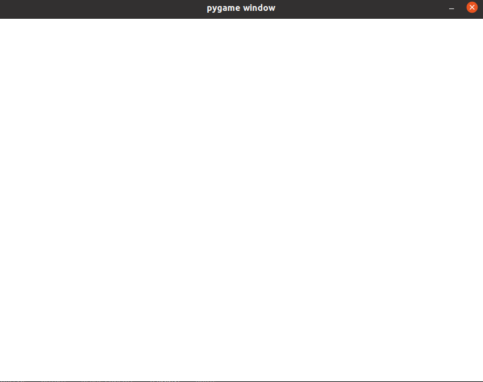
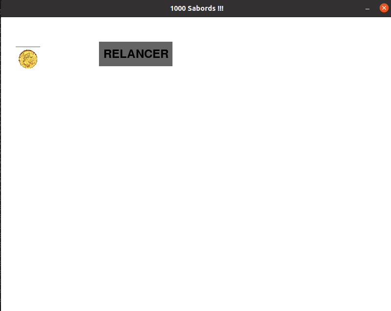
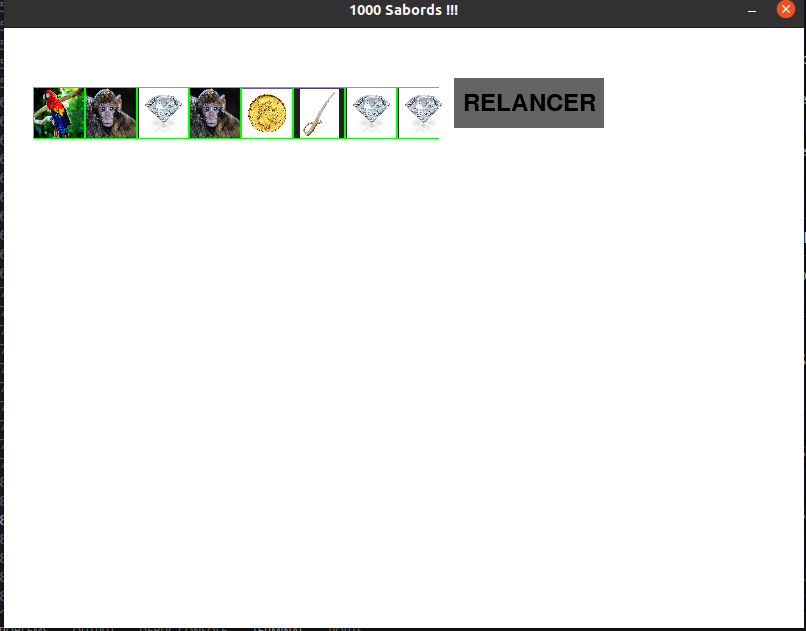
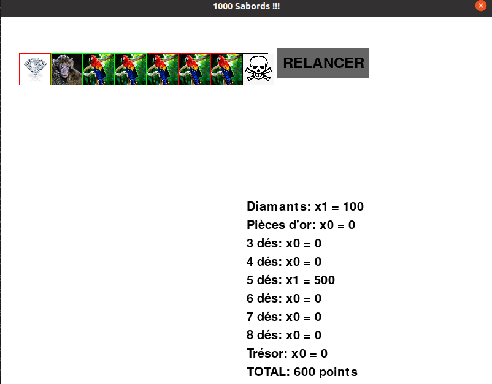

# 1000 Sabords !!

Nous allons programmer le jeu '1000 Sabords' en python. Vous trouverez une liste de missions ci-dessous, votre but est de remplir 1 mission par jour. Si vous vous sentez d'attaque vous pouvez en faire plus, mais déjà si vous en faites une par jour ca sera déjà très bien !

## Avant de commencer à programmer
Il vous faut de quoi programmer et exécuter le jeu. Pour ce faire, commencez par les étapes suivantes:

### Installer python
Pour tester si vous avez déjà python sur votre machine:

1. ouvrez un terminal de commande: Dans le menu `Démarrer`, tapez `cmd` (pour 'commande'). Cliquez sur `ouvrir` sur le premier résultat
2. dans le terminal (la fenêtre noire), tapez `python --version`.
  * Si ca affiche un message du genre `Python 3.9.0`, c'est bon, python est déjà installé
  * Sinon:
    * Sur Internet, allez sur https://www.python.org/downloads/
    * Cliquez sur `Download Python 3.12.3`
    * Une fois que c'est fait, sur votre PC allez dans le répertoire `Téléchargements` et double-cliquez sur le ficher téléchargé
      * Suivez les instructions à l'écran

### Installer pip
Pip est un programme de téléchargement dédié aux libraires python. Nous allons en avoir besoin pour installer la librairie `pygame` qui contient du code utile pour la création de jeux vidéo.

Pour tester si vous avez déjà pip sur votre machine:

1. si ce n'est déjà fait, ouvrez un terminal de commande (comme expliqué au-dessus)
2. dans le terminal, tapez `pip --version`.
  * Si ca affiche un message du genre `pip 20.2.3`, c'est bon, pip est déjà installé
  * Sinon: installez pip en tapant la commande `python pip install`

### Installer pygame
Pygame est une librairie python qui facilite le développement de jeux.

Pour installer pygame, faites ceci:

1. si ce n'est déjà fait, ouvrez un terminal de commande (comme expliqué plus haut)
2. dans le terminal, tapez `pip install pygame`

### Installer VSCode
On a tout ce qu'il faut pour faire fonctionner le jeu, mais maintenant il faut l'écrire. VSCode est un logiciel dédié à l'écriture de programmes (je l'utilise moi-même régulièrement pour le travail).

Pour installer VSCode, faites ceci:

1. Sur Internet, allez sur https://code.visualstudio.com/download
2. Cliquez sur le bouton `Windows`
3. Sur votre PC allez dans le répertoire `Téléchargements` et double-cliquez sur le fichier téléchargé
  * Suivez les instructions à l'écran

### Maintenant on peut commencer :)
* Lancez VSCode depuis le menu `Démarrer`
* Dans la partie gauche de l'écran (`Explorer`), faites un click droit puis choisissez `nouveau fichier...`
* Appelez-le `jeu.py`. Il va s'ouvrir dans la partie de droite de l'écran. Un fichier vide mais qui ne va pas rester vide.
* Pour vérifier que tout fonctionne, écrivez (ou copiez-collez) ce code dans `jeu.py`:

```
# Chargement de la librairie 'pygame'
import pygame

# Couleur de fond d'écran
white = (255, 255, 255)

# Initialization de pygame
pygame.init()

# On crée une fenêtre de 800 pixels de long et de 600 pixels de haut qui contiendra notre jeu
win_size = (800, 600)
screen = pygame.display.set_mode(win_size)
# Un nom sympa qui s'affichera en haut de la fenêtre
pygame.display.set_caption("1000 Sabords !!!")

# Si on ne fait rien de spécial le programme va se terminer immédiatement.
# On crée donc une boucle infinie qui s'arrêtera quand on ferme la fenêtre avec la croix
running = True
while running:
    for event in pygame.event.get():
        # Faire une action (cliquer, appuyer sur une touche) s'appelle un 'event' (événement)
        # On regarde à chaque tour de boucle si on a cliqué sur la croix (événement 'QUIT')
        if event.type == pygame.QUIT:
            running = False

    # On dessine sur l'écran (pour le moment juste un fond blanc)
    screen.fill(white)

    # On rafraichit l'écran (on affiche le nouvel écran à la place de l'ancien)
    pygame.display.flip()

# Si on arrive ici c'est qu'on a quitté le jeu (on est donc sorti de la boucle infinie)
# On ferme le programme proprement
pygame.quit()
```
* Pour tester que ca fonctionne, démarrez le programme. Dans VSCode, en haut de la fenêtre de jeu.py, il y a un petit triangle (comme un bouton 'play'). Appuyez dessus.
* Si tout va bien, une fenêtre blanche va s'afficher. Cliquez sur la croix pour la fermer.



Félicitations, vous êtes maintenant prêt à programmer le jeu de 1000 Sabords !

## 1ère mission: jeter un dé
Pour commencer nous allons afficher un dé, et un bouton 'RELANCER' qui permet de relancer le dé. Pour ce dé nous avons besoin de six images qui représentent ses faces:
* Un diamant
* Une pièce d'or
* Un singe
* Un perroquet
* Un sabre
* Une tête de mort

Sur Internet, cherchez une image adéquate pour chacune de ces six faces. Téléchargez-les et mettez-les dans le même répertoire que là où se trouve votre fichier `jeu.py`. Les images devraient apparaitre dans VSCode dans la colonne de gauche. Renommez ces images en fonction de ce qu'elles représentent.

### Le premier dé

Il est temps de commencer à programmer. Notre dé aura une dimension de 50x50 pixels et sera affiché vers la gauche de l'écran. La face affichée sera choisie aléatoirement.

Dans la logique de la programmation, on commence par choisir une valeur au hasard entre 1 et 6, on choisit l'image correspondante au numéro, et on l'affiche. Inspirez-vous des morceaux de code suivants, à vous de voir où les positionner pour que tout fonctionne. Il y aura quelques ajustements à faire en fonction du nom de vos images...

```
# librairie qui sert à choisir des nombres aléatoires
import random
```

```
# dictionnaire qui associe une 'clé' (nombre de 1 à 6) à une 'valeur' (nom de l'image)
images = {
    1: pygame.image.load('diamant.png'),
    2: pygame.image.load('piece_or.png'),
    3: pygame.image.load('singe.png'),
    4: pygame.image.load('perroquet.png'),
    5: pygame.image.load('sabre.png'),
    6: pygame.image.load('tete_de_mort.png')
}
```

```
# Fonction pour lancer le dé
def lancer_de():
    return random.randint(1, 6)
```

```
# Initialisation de la face du dé (on le lance une fois)
de_1 = lancer_de()
```

```
# Afficher le dé (attention cette partie doit être dans la boucle infinie)
# Explications:
#   image[de_1] : récupère l'image dans le dictionnaire correspondant au numéro aléatoire
#   pygame.transform.scale(..., (50, 50)) : redimensionne l'image à la taille de 50x50 pixels
#   screen.blit(..., (30, 60)) : positionne l'image à 30 pixels du bord gauche et à 60 pixels du haut de l'écran
screen.blit(pygame.transform.scale(images[de_1], (50, 50)), (30, 60))
```

Testez votre code en appuyant sur le bouton 'play'. À chaque fois que vous démarrez votre jeu vous verrez que le dé affiche une des 6 images possibles.

### Le bouton RELANCER
Il reste à ajouter un bouton RELANCER. Le code suivant sera utile, à vous de le placer au bon endroit...

```
# Couleurs pour notre bouton RELANCER
button_color = (100, 100, 100)
text_color = (0, 0, 0)
```

```
# Définir les dimensions et la position du bouton, nécessaire pour savoir quand on clique dessus
# Explications:
#  200: position du bouton par rapport au bord gauche
#  50: position du bouton par rapport au haut de la fenêtre
#  150: longueur du bouton
#  50: hauteur du bouton
bouton_relancer = pygame.Rect(200, 50, 150, 50)
```

```
# Afficher le bouton RELANCER:
# on affiche un rectangle gris de la taille de notre bouton
pygame.draw.rect(screen, button_color, bouton_relancer)
# on choisit une police de taille 36 pour écrire en grosses lettres
font = pygame.font.Font(None, 36)
# on crée une variable text_surf qui contiendra le texte RELANCER
text_surf = font.render("RELANCER", True, text_color)
# on définit un que notre texte doit être centré sur notre bouton
text_rect = text_surf.get_rect(center=bouton_relancer.center)
# enfin, on affiche le texte centré par-dessus le rectangle gris
screen.blit(text_surf, text_rect)
```

```
# On teste si un bouton est cliqué (événement 'MOUSEBUTTONDOWN')
# (le mot-clé 'elif' est la même chose que 'else if', ca doit vous aider à comprendre où placer ce code)
elif event.type == pygame.MOUSEBUTTONDOWN:
    # à cet endroit dans le code, on sait que la souris a été cliquée. On teste pour savoir si on a cliqué sur le bouton RELANCER
    if bouton_relancer.collidepoint(event.pos):
        # à cet endroit dans le code, on sait qu'on a cliqué sur le bouton RELANCER. Reste à assigner une nouvelle face à notre dé
        de_1 = lancer_de()  # Relancer le dé
```

N'hésitez pas à tester au fur et à mesure. Si tout va bien, vous devriez maintenant avoir un jeu où on peut relancer le dé à chaque fois qu'on appuie sur le bouton. Bon, y'a encore du boulot pour avoir un jeu complet, mais c'est déjà une très bonne base ! Félicitations et à demain pour le deuxième module.



|:warning: FAITES UNE SAUVEGARDE ! :warning:|
|--------|
|Faites une copie de `jeu.py` et renommez la copie `jeu1.py`. Si vous cassez votre code avec le deuxième module vous pourrez repartir d'un code qui fonctionne...|

## 2ème mission: afficher 8 dés, bloquer des dés
Un dé c'est bien, mais il nous en faut huit !
Nous allons donc faire les choses suivantes:
* afficher 8 dés au lieu d'un seul
* leur ajouter un bord qui pourra changer de couleur
  * bord vert: le dé peut être relancé
  * bord rouge: le dé est bloqué (on ne veut pas le relancer)
  * bord noir: le dé est bloqué pour toujours (pour les têtes de mort)
* on pourra bloquer / débloquer des dés en cliquant dessus
* on pourra relancer les dés à bord vert

### Les 7 autres dés

Commencez par ajouter 7 dés supplémentaires. Pour ce faire, donnez un nom à chacun des dés. Le dé actuel est associé à la variable `de_1`.
* en regardant comment `de_1` a été initialisé, ajoutez l'initialisation des variables `de_2`, `de_3` etc jusqu'à `de_8`
* affichez les dés supplémentaires à droite du premier dé. Espacez les dés de 52 pixels à chaque fois (en prévision de l'ajout du bord de couleur)
* le bouton RELANCER apparaitra sur les dés, déplacez le bouton sur la droite pour que ca ne chevauche plus (le placer à 450 pixels du bord gauche devrait être amplement suffisant).
* enfin, ajoutez le code nécessaire pour que, lorsque l'on clique sur le bouton RELANCER, tous les dés soient relancés et pas uniquement `de_1`.

### Le bord de couleur

Nous allons maintenant ajouter un bord de couleur (vert, rouge, noir) aux dés. Pour ce faire, nous allons dessiner un carré de 52x52 pixels derrière le dé de 50x50 pixels. Si les deux carrés sont bien centrés, il devrait rester un bord de 1 pixel tout autour de notre dé.

Utilisez le code suivant pour définir les couleurs:

```
# couleurs des bords des dés
green = (0, 255, 0)
red = (255, 0, 0)
black = (0, 0, 0)
```

Chaque dé va avoir une variable qui contient sa couleur. Voici le code pour initialiser la couleur `de_1`, mettez ce code au bon endroit et initialisez les autres dés sur cette même couleur

```
# Initialiser la couleur du bord
couleur_de_1 = green
```

Affichez les carrés de couleur avant d'afficher les dés (si vous affichez les carrés après, il apparaitront par-dessus les dés au lieu d'en dessous). Voici le code pour le premier dé, à compléter:

```
# Dessiner le carré vert derrière le dé_1
# Explications:
#   29: à 29 pixels du bord (car le dé 1 est à 30 pixels)
#   59: à 59 pixels du haut (car le dé 1 est à 60 pixels)
#   52: longueur du carré (50 + 2 pour dépasser de 1 pixel de chaque côté)
#   52: hauteur du carré (50 + 2 pour dépasser de 1 pixel en haut et en bas)
pygame.draw.rect(screen, couleur_de_1, pygame.Rect(29, 59, 52, 52))
```

### Bloquer / debloquer un dé
Dans la partie initialisation, ajoutez le code qui définit où se trouvent les dés. Ce sont les même coordonnées que vous avez utilisé dans les lignes `pygame.draw.rect(screen, couleur_de_1, pygame.Rect(29, 59, 52, 52))`

Voici le code pour le dé 1, à compléter pour les autres:

```
# Définir les rectangles pour chaque dé pour détecter les clics
rect_de_1 = pygame.Rect(29, 59, 52, 52)
```

Maintenant que nous avons les variables `rect_de_1` etc, nous pouvons les utiliser pour tester si on a cliqué sur un dé. Le code suivant teste si on a cliqué sur le dé 1, ce code inverse la couleur de vert à rouge et inversemenent. À placer au bon endroit et à compléter pour les autres dés.

```
elif rect_de_1.collidepoint(event.pos):
    # on a cliqué sur le dé numéro 1
    if couleur_de_1 == green:
        couleur_de_1 = red
    elif couleur_de_1 == red:
        couleur_de_1 = green
```

Note: avez vous vu qu'on ne teste pas pour la couleur noir ? C'est parce que cette couleur va être dédiée aux têtes de mort. Un dé à bord noir ne changera donc pas de couleur en cliquant dessus.

### Relancer les dés verts uniquement
Modifiez la ligne de code suivante: `de_1 = lancer_de()  # Relancer le dé` de manière à le relancer uniquement si son fond est vert.

Une fois que c'est fait, faites pareil pour les autres dés.

### Mettre les têtes de mort sur fond noir
Il reste une dernière chose à faire: dès qu'un dé affiche une tête de mort, on change la couleur sur noir de manière à ce qu'on ne puisse plus le relancer.

Dans le dictionnaire, nous avons associé la tête de mort au numéro 6. Il suffit alors, après un lancer de dé, de regarder si ce dé est sur le 6. Si oui, on change sa couleur pour le noir. Ajoutez ce code juste après avoir lancé le dé 1:

```
if de_1 == 6:
    couleur_de_1 = black
```
Faites la même chose pour les autres dés.

Il reste maintenant un petit bug à corriger: vous avez peut-être remarqué que si en lancant le jeu vous avez des têtes de mort, elles sont sur fond vers et pas sur fond noir. La faute à quoi ? À ce code que vous avez mis tout à l'heure:

```
# Initialiser la couleur du bord
couleur_de_1 = green
```

La solution ? Pour chaque dé, mettre la couleur à noir si le dé a une valeur de 6 et à vert sinon. Le code qui va faire ca, vous l'aurez probablement trouvé par vous-même, est le suivant:

```
# Initialiser la couleur du bord
# Cas particulier: le dé tombe directement sur une tête de mort
if de_1 == 6:
  couleur_de_1 = black
else:
  couleur_de_1 = green
```

Testez votre code si ce n'est déjà fait (on ne fait jamais trop de tests !). Si vous ne bloquez aucun dé et que vous relancez plusieurs fois, vous finirez par avoir 8 têtes de mort.

Si c'est le cas, félicitations, vous avez rempli votre deuxième mission avec succès !



|:warning: FAITES UNE SAUVEGARDE ! :warning:|
|--------|
|Faites une copie de `jeu.py` et renommez la copie `jeu2.py`. Si vous cassez votre code avec le troisième module vous pourrez repartir d'un code qui fonctionne...|


## 3ème mission: trier les dés, calculer le score potentiel
Dans cette mission nous allons aider le joueur à y voir plus clair. Au menu:
  * classer les dés automatiquement par face
  * calculer le score potentiel

### Classer les dés
L'idée est de grouper ensemble les dés qui sont sur la même face. Nous allons les classer par ordre de valeur (de 1 à 6), ce qui nous donnera l'ordre suivant:
* diamant
* pièce d'or
* singe
* perroquet
* sabre
* tête de mort
Pour classer les dés, nous allons procéder comme suit:
1. regarder la valeur des 8 dés, sauver ces valeurs dans un tableau
2. trier le tableau par ordre croissant
3. assigner les nouvelles valeurs aux dés

C'est assez simple à faire en python, placez ce code au bon endroit:
```
# On stocke le contenu des variables dans un tableau
stockage = [de_1, de_2, de_3, de_4, de_5, de_6, de_7, de_8]
# On trie dans l'ordre croissant
stockate.sort()
# On ré-assigne les valeurs triées aux variables
de_1, de_2, de_3, de_4, de_5, de_6, de_7, de_8 = stockage
```

Si vous avez mis le code au bon endroit, vous devriez voir que les dés sont triés. Mais après avoir relancé quelques fois, vous devriez voir un problème: quand un dé prend la valeur 'tête de mort', son bord devient noir et il ne peut plus être relancé. Mais avec le tri automatique, la tête de mort se déplace vers la droite, et c'est un autre dé qui garde le bord noir... Bref, le problème est que quand on déplace un dé, il faut également déplacer la couleur de son bord !

Il va donc falloir faire plus subtil. Nous allons non seulement stocker la valeur des dés mais également leur couleur dans le tableau, avant de le trier.

Pour ce faire, dans le tableau stockage, au lieu de `de_1`, mettez `(de_1, couleur_de_1)` et faites la même chose pour les autres dés. Ca va stocker dans le notre tableau la valeur de dés ainsi que leur couleur. La commande qui fait le tri reste identique: par défaut, le tri se fait sur la première valeur stockée de chaque élément, c'est à dire la valeur du dé.

Enfin, lors de la ré-assignation, là encore au lieu de mettre `de_1` il suffit de mettre `(de_1, couleur_de_1)`, python comprendra qu'il doit récupérer la première valeur et la mettre dans la variable `de_1`, puis la première couleur et la mettre dans la variable `couleur_de_1`, etc.

Il n'y a plus qu'à tester ! Si vous voyez encore un truc qui cloche - si quand vous cliquez sur un dé, ce n'est pas le bon dé qui change de couleur, c'est parce que le tri n'est pas fait au bon endroit. En effet, chaque fois que l'on appuie sur quelque-chose, tout l'écran est redessiné. Si le tri est fait trop tôt dans la boucle infinie ou trop tard, alors les dés sont triés à nouveau, ce qui peut déplacer la couleur du fond. La solution ? Mettre ce code de tri dans la partie du code où on a appuyé sur le bouton RELANCER, juste après avoir effectivement relancé les dés.

Il reste encore un cas à traiter: si vous avez suivi ces explications, alors il est fort probable que le tri fonctionne... sauf pour le tout premier jet, avant qu'on ait appuyé sur RELANCER. La solution ? Copiez le code de tri que vous venez d'écrire et collez-le juste après avoir initialisé la première valeur et la première couleur des dés. Vous aurez donc un premier tri lors du premier affichage des dés et un nouveau tri après chaque relance.

### Le score potentiel
Ca commence à bien prendre forme !

Maintenant nous allons aider le joueur à savoir combien sa combinaison affichée vaut de points. Pour ce faire nous allons regarder les points suivants:
* 0 point sur 3 têtes de mort ou plus
* 100 points par diamants
* 100 points par pièce d'or
* séries de dés identiques:
  * 100 points par série de 3
  * 200 points par série de 4
  * 500 points par série de 5
  * 1000 points par série de 6
  * 2000 points par série de 7
  * 4000 points par série de 8
* bonus de 500 points si zéro tête de mort

Pour commencer nous allons afficher une zone de texte en bas à droite qui fait le calcul des diamants et des pièces d'or.

Il nous faut une variable `total` qui va contenir le score total, une variable `mult_diamants` qui contient le nombre de diamants par lequel il faut multiplier, et une variable `mult_pieces` qui contient le multiplicateur pour les pièces d'or.

Pour voir si l'affichage fonctionne, on donne des valeurs quelconques à ces variables, ce qui donne:

```
# Variables pour le calcul du score
mult_diamants = 1
mult_pieces = 2
total = 300

# Afficher la zone de texte pour les scores
font = pygame.font.Font(None, 30)
# Le texte que l'on va afficher, et où les variables seront mises à jour
scores_text = [
    f"Diamants: x{mult_diamants} = {100 * mult_diamants}",
    f"Pièces d'or: x{mult_pieces} = {100 * mult_pieces}",
    f"TOTAL: {total} points"
]
# boucle qui prend chaque ligne de texte et qui l'affiche
for i, line in enumerate(scores_text):
    text_surf = font.render(line, True, text_color)
    screen.blit(text_surf, (400, 300 + i * 30))
```

Le problème de ce code est qu'il marque toujours qu'il y a 1 diamant, 2 pièces d'or et un total de 300 points. Il faut donc maintenant calculer les vraies valeurs de ces variables.

#### Diamants
Pour avoir le bon nombre de diamants, il faut compter le nombre de dés ayant la valeur '1'. Nous pouvons créer la fonction suivante:
```
# fonction qui compte le nombre de dés sur la face 1 (diamant)
def des_face_1():
    compte = 0
    if de_1 == 1:
      compte = compte + 1
    if de_2 == 1:
      compte = compte + 1
    if de_3 == 1:
      compte = compte + 1
    if de_4 == 1:
      compte = compte + 1
    if de_5 == 1:
      compte = compte + 1
    if de_6 == 1:
      compte = compte + 1
    if de_7 == 1:
      compte = compte + 1
    if de_8 == 1:
      compte = compte + 1
    return compte
```

Maintenant, au lieu de cette ligne de code qui fixe le multiplicateur de diamants à 1:
```
mult_diamants = 1
```
Nous pouvons écrire ce code qui va appeler la fonction des_diamant pour compter les dés sur la face diamant:
```
mult_diamants = des_face_1()
```

Testez ce code pour voir si le nombre de diamants varie bien en fonction du nombre de diamants affichés.

Si c'est le cas, bravo à vous ! Il ne reste plus qu'à suivre la même approche pour faire les autres calculs:

#### Pièces d'or
Pour les pièces d'or: écrivez une fonction `des_face_2` qui compte le nombre de dés sur la face 2 (pièce d'or), et mettez à jour la variable `mult_pieces` pour qu'elle appelle cette fonction.

#### Séries de 3
Pour les séries de 3 dés identiques, il nous faut une fonction qui calcule si nous avons 3 dés sur la face 1, si nous avons 3 dés sur la face 2, etc.

Écrivez les fonctions `des_face_3`, `des_face_4`, `des_face_5` et `des_face_6`.

Pour calculer les séries de 3 dés identiques, utilisez ce code:
```
def serie_de_3():
    compte = 0
    if des_face_1() == 3:
      compte = compte + 1
    if des_face_2() == 3:
      compte = compte + 1
    if des_face_3() == 3:
      compte = compte + 1
    if des_face_4() == 3:
      compte = compte + 1
    if des_face_5() == 3:
      compte = compte + 1
    if des_face_6() == 3:
      compte = compte + 1
    return compte
```

Ajoutez une variable `mult_serie_3` là où vous avez déclaré les variables `mult_diamants` et `mult_pieces` et assignez à cette variable le nombre de séries de 3:
```
mult_serie_3 = serie_de_3()
```

Ajoutez une ligne de texte à la variable `scores_text` pour afficher les séries de trois:

```
scores_text = [
    f"Diamants: x{mult_diamants} = {100 * mult_diamants}",
    f"Pièces d'or: x{mult_pieces} = {100 * mult_pieces}",
    f"3 dés: x{mult_serie_3} = {100 * mult_serie_3}",
    f"TOTAL: {total} points"
]
```

### Séries de 4, 5, 6, 7, 8
Faites la même chose pour les séries de 4, 5, 6, 7 ou 8 dés:
* écrivez les fonctions `serie_de_4`, `serie_de_5`, `serie_de_6` etc. qui compte le nombre de fois où nous avons 4 dés identiques, 5 dés identiques etc.
* ajoutez une variable `mult_serie_4`, `mult_serie_5` etc qui recevra le résultat de l'appel de la fonction correspondante.
* ajoutez le texte à `scores_text` pour ajouter les séries de 4 5 6 etc. Prenez garde à la valeur de multiplicateur: c'est 100 points pour une série de 3 dés, mais après il faut mettre la bonne valeur. Pour rappel:
  * 4 dés: multiplier par 200
  * 5 dés: multiplier par 500
  * 6 dés: multiplier par 1000
  * 7 dés: multiplier par 200
  * 8 dés: multiplier par 4000

### Bonus trésor
Le bonus trésor est de 500 points s'il n'y a aucune tête de mort. Vous avez déjà écrit la fonction qui compte les têtes de mort: la fonction `des_face_6` ! :)

Il suffit donc de compter si le résultat de des_face_6 est de zéro pour savoir si on a droit au bonus trésor.

Ajoutez une variable `mult_tresor`, sa valeur devra être la suivante:
```
if des_face_6() == 0:
  mult_tresor = 1
else:
  mult_tresor = 0
```

Ajoutez cette ligne de texte à `scores_text`
```
f"Trésor: x{mult_tresor} = {500 * mult_tresor}",
```

#### Total
Il est temps de mettre à jour notre variable `total` qui est restée désespérément à la valeur 300, Remplacez la ligne
```
total = 300
```
Par ce calcul:
```
total = (100 * mult_diamants) + (100 * mult_pieces) + (100 * mult_serie_3) + (200 * mult_serie_4) + (500 * mult_serie_5) + (1000 * mult_serie_6) + (2000 * mult_serie_7) + (4000 * mult_serie_8) + (500 * mult_tresor)
```

#### 3 têtes de mort
C'est terminé ? Pas tout à fait !

Quand on a 3 têtes de mort ou plus, le score est de zéro. On va ajouter le code suivant juste avant la boucle qui affiche le contenu de scores_text:

```
if des_face_6() >= 3:
    total = 0
    scores_text = [
        f"OH NON, C'EST PERDU !",
        f"TOTAL: {total} points"
    ]
```

Ce que fait ce code est la chose suivante:
* on mets le total à 0, ce qui écrase la valeur calculée précédemment
* on écrase le contenu de score_text avec un texte qui dit juste que c'est perdu. C'est donc ce texte qui sera affiché au lieu du calcul complet.

Cette fois c'est terminé, vous pouvez être fier de vous !



|:warning: FAITES UNE SAUVEGARDE ! :warning:|
|--------|
|Faites une copie de `jeu.py` et renommez la copie `jeu3.py`. Si vous cassez votre code avec le quatrième module vous pourrez repartir d'un code qui fonctionne...|


## 4ème mission: stopper son tour, score global, fin à 6000 points
## 5ème mission: jouer à plusieurs, fin de tour
## 6ème mission: l'île de la tête de mort
## 7ème mission: on affiche les cartes
## 8ème mission: on code les règles spéciales
## 9ème mission: jouer contre... l'ordinateur

## Félicitations !!!
Vous avez codé le jeu de 1000 Sabords en python en juste quelques jours, c'est du bon boulot ! Vous pouvez l'améliorer en ajoutant de nouvelles cartes de votre invention, en rendant le jeu plus joli... ou tout simplement en y jouant avec vos amis !
