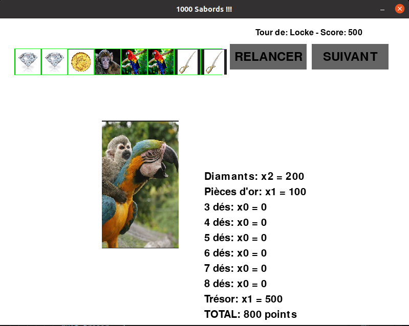
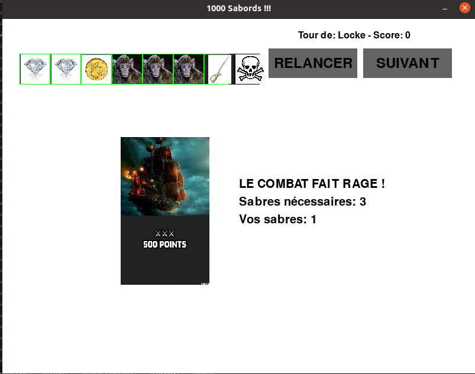
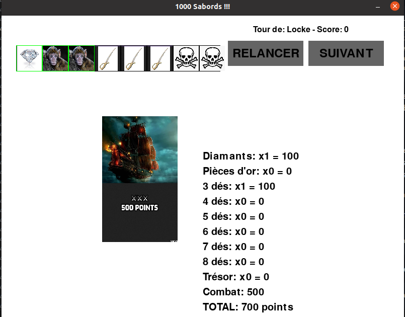
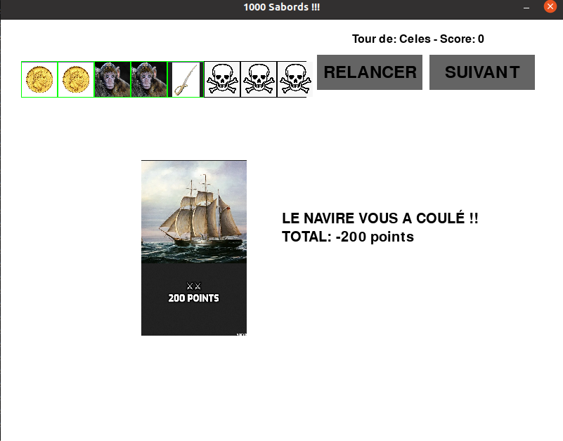
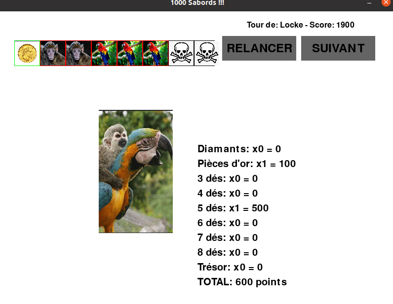

# 1000 Sabords !!

Nous allons programmer le jeu '1000 Sabords' en python. Vous trouverez une liste de missions ci-dessous, votre but est de remplir 1 mission par jour. Si vous vous sentez d'attaque vous pouvez en faire plus, mais déjà si vous en faites une par jour ca sera déjà très bien !

## Avant de commencer à programmer
Il vous faut de quoi programmer et exécuter le jeu. Pour ce faire, commencez par les étapes suivantes:

### Installer python
Pour tester si vous avez déjà python sur votre machine:

1. ouvrez un terminal de commande: Dans le menu `Démarrer`, tapez `cmd` (pour 'commande'). Cliquez sur `ouvrir` sur le premier résultat
2. dans le terminal (la fenêtre noire), tapez `python --version`.
  * Si ca affiche un message du genre `Python 3.9.0`, c'est bon, python est déjà installé
  * Sinon:
    * Sur Internet, allez sur https://www.python.org/downloads/
    * Cliquez sur `Download Python 3.12.3`
    * Une fois que c'est fait, sur votre PC allez dans le répertoire `Téléchargements` et double-cliquez sur le ficher téléchargé
      * Suivez les instructions à l'écran

### Installer pip
Pip est un programme de téléchargement dédié aux libraires python. Nous allons en avoir besoin pour installer la librairie `pygame` qui contient du code utile pour la création de jeux vidéo.

Pour tester si vous avez déjà pip sur votre machine:

1. si ce n'est déjà fait, ouvrez un terminal de commande (comme expliqué au-dessus)
2. dans le terminal, tapez `pip --version`.
  * Si ca affiche un message du genre `pip 20.2.3`, c'est bon, pip est déjà installé
  * Sinon: installez pip en tapant la commande `python pip install`

### Installer pygame
Pygame est une librairie python qui facilite le développement de jeux.

Pour installer pygame, faites ceci:

1. si ce n'est déjà fait, ouvrez un terminal de commande (comme expliqué plus haut)
2. dans le terminal, tapez `pip install pygame`

### Installer VSCode
On a tout ce qu'il faut pour faire fonctionner le jeu, mais maintenant il faut l'écrire. VSCode est un logiciel dédié à l'écriture de programmes (je l'utilise moi-même régulièrement pour le travail).

Pour installer VSCode, faites ceci:

1. Sur Internet, allez sur https://code.visualstudio.com/download
2. Cliquez sur le bouton `Windows`
3. Sur votre PC allez dans le répertoire `Téléchargements` et double-cliquez sur le fichier téléchargé
  * Suivez les instructions à l'écran

### Maintenant on peut commencer :)
* Lancez VSCode depuis le menu `Démarrer`
* Dans la partie gauche de l'écran (`Explorer`), faites un click droit puis choisissez `nouveau fichier...`
* Appelez-le `jeu.py`. Il va s'ouvrir dans la partie de droite de l'écran. Un fichier vide mais qui ne va pas rester vide.
* Pour vérifier que tout fonctionne, écrivez (ou copiez-collez) ce code dans `jeu.py`:

```
# Chargement de la librairie 'pygame'
import pygame

# Couleur de fond d'écran
white = (255, 255, 255)

# Initialization de pygame
pygame.init()

# On crée une fenêtre de 800 pixels de long et de 600 pixels de haut qui contiendra notre jeu
win_size = (800, 600)
screen = pygame.display.set_mode(win_size)
# Un nom sympa qui s'affichera en haut de la fenêtre
pygame.display.set_caption("1000 Sabords !!!")

# Si on ne fait rien de spécial le programme va se terminer immédiatement.
# On crée donc une boucle infinie qui s'arrêtera quand on ferme la fenêtre avec la croix
running = True
while running:
    for event in pygame.event.get():
        # Faire une action (cliquer, appuyer sur une touche) s'appelle un 'event' (événement)
        # On regarde à chaque tour de boucle si on a cliqué sur la croix (événement 'QUIT')
        if event.type == pygame.QUIT:
            running = False

    # On dessine sur l'écran (pour le moment juste un fond blanc)
    screen.fill(white)

    # On rafraichit l'écran (on affiche le nouvel écran à la place de l'ancien)
    pygame.display.flip()

# Si on arrive ici c'est qu'on a quitté le jeu (on est donc sorti de la boucle infinie)
# On ferme le programme proprement
pygame.quit()
```
* Pour tester que ca fonctionne, démarrez le programme. Dans VSCode, en haut de la fenêtre de jeu.py, il y a un petit triangle (comme un bouton 'play'). Appuyez dessus.
* Si tout va bien, une fenêtre blanche va s'afficher. Cliquez sur la croix pour la fermer.


Félicitations, vous êtes maintenant prêt à programmer le jeu de 1000 Sabords !

## 1ère mission: jeter un dé
Pour commencer nous allons afficher un dé, et un bouton 'RELANCER' qui permet de relancer le dé. Pour ce dé nous avons besoin de six images qui représentent ses faces:
* Un diamant
* Une pièce d'or
* Un singe
* Un perroquet
* Un sabre
* Une tête de mort

Sur Internet, cherchez une image adéquate pour chacune de ces six faces. Téléchargez-les et mettez-les dans le même répertoire que là où se trouve votre fichier `jeu.py`. Les images devraient apparaitre dans VSCode dans la colonne de gauche. Renommez ces images en fonction de ce qu'elles représentent.

### Le premier dé

Il est temps de commencer à programmer. Notre dé aura une dimension de 50x50 pixels et sera affiché vers la gauche de l'écran. La face affichée sera choisie aléatoirement.

Dans la logique de la programmation, on commence par choisir une valeur au hasard entre 1 et 6, on choisit l'image correspondante au numéro, et on l'affiche. Inspirez-vous des morceaux de code suivants, à vous de voir où les positionner pour que tout fonctionne. Il y aura quelques ajustements à faire en fonction du nom de vos images...

```
# librairie qui sert à choisir des nombres aléatoires
import random
```

```
# dictionnaire qui associe une 'clé' (nombre de 1 à 6) à une 'valeur' (nom de l'image)
images = {
    1: pygame.image.load('diamant.png'),
    2: pygame.image.load('piece_or.png'),
    3: pygame.image.load('singe.png'),
    4: pygame.image.load('perroquet.png'),
    5: pygame.image.load('sabre.png'),
    6: pygame.image.load('tete_de_mort.png')
}
```

```
# Fonction pour lancer le dé
def lancer_de():
    return random.randint(1, 6)
```

```
# Initialisation de la face du dé (on le lance une fois)
de_1 = lancer_de()
```

```
# Afficher le dé (attention cette partie doit être dans la boucle infinie)
# Explications:
#   image[de_1] : récupère l'image dans le dictionnaire correspondant au numéro aléatoire
#   pygame.transform.scale(..., (50, 50)) : redimensionne l'image à la taille de 50x50 pixels
#   screen.blit(..., (30, 60)) : positionne l'image à 30 pixels du bord gauche et à 60 pixels du haut de l'écran
screen.blit(pygame.transform.scale(images[de_1], (50, 50)), (30, 60))
```

Testez votre code en appuyant sur le bouton 'play'. À chaque fois que vous démarrez votre jeu vous verrez que le dé affiche une des 6 images possibles.

### Le bouton RELANCER
Il reste à ajouter un bouton RELANCER. Le code suivant sera utile, à vous de le placer au bon endroit...

```
# Couleurs pour notre bouton RELANCER
button_color = (100, 100, 100)
text_color = (0, 0, 0)
```

```
# Définir les dimensions et la position du bouton, nécessaire pour savoir quand on clique dessus
# Explications:
#  200: position du bouton par rapport au bord gauche
#  50: position du bouton par rapport au haut de la fenêtre
#  150: longueur du bouton
#  50: hauteur du bouton
bouton_relancer = pygame.Rect(200, 50, 150, 50)
```

```
# Afficher le bouton RELANCER:
# on affiche un rectangle gris de la taille de notre bouton
pygame.draw.rect(screen, button_color, bouton_relancer)
# on choisit une police de taille 36 pour écrire en grosses lettres
font = pygame.font.Font(None, 36)
# on crée une variable text_surf qui contiendra le texte RELANCER
text_surf = font.render("RELANCER", True, text_color)
# on définit un que notre texte doit être centré sur notre bouton
text_rect = text_surf.get_rect(center=bouton_relancer.center)
# enfin, on affiche le texte centré par-dessus le rectangle gris
screen.blit(text_surf, text_rect)
```

```
# On teste si un bouton est cliqué (événement 'MOUSEBUTTONDOWN')
# (le mot-clé 'elif' est la même chose que 'else if', ca doit vous aider à comprendre où placer ce code)
elif event.type == pygame.MOUSEBUTTONDOWN:
    # à cet endroit dans le code, on sait que la souris a été cliquée. On teste pour savoir si on a cliqué sur le bouton RELANCER
    if bouton_relancer.collidepoint(event.pos):
        # à cet endroit dans le code, on sait qu'on a cliqué sur le bouton RELANCER. Reste à assigner une nouvelle face à notre dé
        de_1 = lancer_de()  # Relancer le dé
```

N'hésitez pas à tester au fur et à mesure. Si tout va bien, vous devriez maintenant avoir un jeu où on peut relancer le dé à chaque fois qu'on appuie sur le bouton. Bon, y'a encore du boulot pour avoir un jeu complet, mais c'est déjà une très bonne base ! Félicitations et à demain pour le deuxième module.


|:warning: FAITES UNE SAUVEGARDE ! :warning:|
|--------|
|Faites une copie de `jeu.py` et renommez la copie `jeu1.py`. Si vous cassez votre code avec le deuxième module vous pourrez repartir d'un code qui fonctionne...|

## 2ème mission: afficher 8 dés, bloquer des dés
Un dé c'est bien, mais il nous en faut huit !
Nous allons donc faire les choses suivantes:
* afficher 8 dés au lieu d'un seul
* leur ajouter un bord qui pourra changer de couleur
  * bord vert: le dé peut être relancé
  * bord rouge: le dé est bloqué (on ne veut pas le relancer)
  * bord noir: le dé est bloqué pour toujours (pour les têtes de mort)
* on pourra bloquer / débloquer des dés en cliquant dessus
* on pourra relancer les dés à bord vert

### Les 7 autres dés

Commencez par ajouter 7 dés supplémentaires. Pour ce faire, donnez un nom à chacun des dés. Le dé actuel est associé à la variable `de_1`.
* en regardant comment `de_1` a été initialisé, ajoutez l'initialisation des variables `de_2`, `de_3` etc jusqu'à `de_8`
* affichez les dés supplémentaires à droite du premier dé. Espacez les dés de 52 pixels à chaque fois (en prévision de l'ajout du bord de couleur)
* le bouton RELANCER apparaitra sur les dés, déplacez le bouton sur la droite pour que ca ne chevauche plus (le placer à 450 pixels du bord gauche devrait être amplement suffisant).
* enfin, ajoutez le code nécessaire pour que, lorsque l'on clique sur le bouton RELANCER, tous les dés soient relancés et pas uniquement `de_1`.

### Le bord de couleur

Nous allons maintenant ajouter un bord de couleur (vert, rouge, noir) aux dés. Pour ce faire, nous allons dessiner un carré de 52x52 pixels derrière le dé de 50x50 pixels. Si les deux carrés sont bien centrés, il devrait rester un bord de 1 pixel tout autour de notre dé.

Utilisez le code suivant pour définir les couleurs:

```
# couleurs des bords des dés
green = (0, 255, 0)
red = (255, 0, 0)
black = (0, 0, 0)
```

Chaque dé va avoir une variable qui contient sa couleur. Voici le code pour initialiser la couleur `de_1`, mettez ce code au bon endroit et initialisez les autres dés sur cette même couleur

```
# Initialiser la couleur du bord
couleur_de_1 = green
```

Affichez les carrés de couleur avant d'afficher les dés (si vous affichez les carrés après, il apparaitront par-dessus les dés au lieu d'en dessous). Voici le code pour le premier dé, à compléter:

```
# Dessiner le carré vert derrière le dé_1
# Explications:
#   29: à 29 pixels du bord (car le dé 1 est à 30 pixels)
#   59: à 59 pixels du haut (car le dé 1 est à 60 pixels)
#   52: longueur du carré (50 + 2 pour dépasser de 1 pixel de chaque côté)
#   52: hauteur du carré (50 + 2 pour dépasser de 1 pixel en haut et en bas)
pygame.draw.rect(screen, couleur_de_1, pygame.Rect(29, 59, 52, 52))
```

### Bloquer / debloquer un dé
Dans la partie initialisation, ajoutez le code qui définit où se trouvent les dés. Ce sont les même coordonnées que vous avez utilisé dans les lignes `pygame.draw.rect(screen, couleur_de_1, pygame.Rect(29, 59, 52, 52))`

Voici le code pour le dé 1, à compléter pour les autres:

```
# Définir les rectangles pour chaque dé pour détecter les clics
rect_de_1 = pygame.Rect(29, 59, 52, 52)
```

Maintenant que nous avons les variables `rect_de_1` etc, nous pouvons les utiliser pour tester si on a cliqué sur un dé. Le code suivant teste si on a cliqué sur le dé 1, ce code inverse la couleur de vert à rouge et inversemenent. À placer au bon endroit et à compléter pour les autres dés.

```
elif rect_de_1.collidepoint(event.pos):
    # on a cliqué sur le dé numéro 1
    if couleur_de_1 == green:
        couleur_de_1 = red
    elif couleur_de_1 == red:
        couleur_de_1 = green
```

Note: avez vous vu qu'on ne teste pas pour la couleur noir ? C'est parce que cette couleur va être dédiée aux têtes de mort. Un dé à bord noir ne changera donc pas de couleur en cliquant dessus.

### Relancer les dés verts uniquement
Modifiez la ligne de code suivante: `de_1 = lancer_de()  # Relancer le dé` de manière à le relancer uniquement si son fond est vert.

Une fois que c'est fait, faites pareil pour les autres dés.

### Mettre les têtes de mort sur fond noir
Il reste une dernière chose à faire: dès qu'un dé affiche une tête de mort, on change la couleur sur noir de manière à ce qu'on ne puisse plus le relancer.

Dans le dictionnaire, nous avons associé la tête de mort au numéro 6. Il suffit alors, après un lancer de dé, de regarder si ce dé est sur le 6. Si oui, on change sa couleur pour le noir. Ajoutez ce code juste après avoir lancé le dé 1:

```
if de_1 == 6:
    couleur_de_1 = black
```
Faites la même chose pour les autres dés.

Il reste maintenant un petit bug à corriger: vous avez peut-être remarqué que si en lancant le jeu vous avez des têtes de mort, elles sont sur fond vers et pas sur fond noir. La faute à quoi ? À ce code que vous avez mis tout à l'heure:

```
# Initialiser la couleur du bord
couleur_de_1 = green
```

La solution ? Pour chaque dé, mettre la couleur à noir si le dé a une valeur de 6 et à vert sinon. Le code qui va faire ca, vous l'aurez probablement trouvé par vous-même, est le suivant:

```
# Initialiser la couleur du bord
# Cas particulier: le dé tombe directement sur une tête de mort
if de_1 == 6:
  couleur_de_1 = black
else:
  couleur_de_1 = green
```

Testez votre code si ce n'est déjà fait (on ne fait jamais trop de tests !). Si vous ne bloquez aucun dé et que vous relancez plusieurs fois, vous finirez par avoir 8 têtes de mort.

Si c'est le cas, félicitations, vous avez rempli votre deuxième mission avec succès !


|:warning: FAITES UNE SAUVEGARDE ! :warning:|
|--------|
|Faites une copie de `jeu.py` et renommez la copie `jeu2.py`. Si vous cassez votre code avec le troisième module vous pourrez repartir d'un code qui fonctionne...|


## 3ème mission: trier les dés, calculer le score potentiel
Dans cette mission nous allons aider le joueur à y voir plus clair. Au menu:
  * classer les dés automatiquement par face
  * calculer le score potentiel

### Classer les dés
L'idée est de grouper ensemble les dés qui sont sur la même face. Nous allons les classer par ordre de valeur (de 1 à 6), ce qui nous donnera l'ordre suivant:
* diamant
* pièce d'or
* singe
* perroquet
* sabre
* tête de mort
Pour classer les dés, nous allons procéder comme suit:
1. regarder la valeur des 8 dés, sauver ces valeurs dans un tableau
2. trier le tableau par ordre croissant
3. assigner les nouvelles valeurs aux dés

C'est assez simple à faire en python, placez ce code au bon endroit:
```
# On stocke le contenu des variables dans un tableau
stockage = [de_1, de_2, de_3, de_4, de_5, de_6, de_7, de_8]
# On trie dans l'ordre croissant
stockate.sort()
# On ré-assigne les valeurs triées aux variables
de_1, de_2, de_3, de_4, de_5, de_6, de_7, de_8 = stockage
```

Si vous avez mis le code au bon endroit, vous devriez voir que les dés sont triés. Mais après avoir relancé quelques fois, vous devriez voir un problème: quand un dé prend la valeur 'tête de mort', son bord devient noir et il ne peut plus être relancé. Mais avec le tri automatique, la tête de mort se déplace vers la droite, et c'est un autre dé qui garde le bord noir... Bref, le problème est que quand on déplace un dé, il faut également déplacer la couleur de son bord !

Il va donc falloir faire plus subtil. Nous allons non seulement stocker la valeur des dés mais également leur couleur dans le tableau, avant de le trier.

Pour ce faire, dans le tableau stockage, au lieu de `de_1`, mettez `(de_1, couleur_de_1)` et faites la même chose pour les autres dés. Ca va stocker dans le notre tableau la valeur de dés ainsi que leur couleur. La commande qui fait le tri reste identique: par défaut, le tri se fait sur la première valeur stockée de chaque élément, c'est à dire la valeur du dé.

Enfin, lors de la ré-assignation, là encore au lieu de mettre `de_1` il suffit de mettre `(de_1, couleur_de_1)`, python comprendra qu'il doit récupérer la première valeur et la mettre dans la variable `de_1`, puis la première couleur et la mettre dans la variable `couleur_de_1`, etc.

Il n'y a plus qu'à tester ! Si vous voyez encore un truc qui cloche - si quand vous cliquez sur un dé, ce n'est pas le bon dé qui change de couleur, c'est parce que le tri n'est pas fait au bon endroit. En effet, chaque fois que l'on appuie sur quelque-chose, tout l'écran est redessiné. Si le tri est fait trop tôt dans la boucle infinie ou trop tard, alors les dés sont triés à nouveau, ce qui peut déplacer la couleur du fond. La solution ? Mettre ce code de tri dans la partie du code où on a appuyé sur le bouton RELANCER, juste après avoir effectivement relancé les dés.

Il reste encore un cas à traiter: si vous avez suivi ces explications, alors il est fort probable que le tri fonctionne... sauf pour le tout premier jet, avant qu'on ait appuyé sur RELANCER. La solution ? Copiez le code de tri que vous venez d'écrire et collez-le juste après avoir initialisé la première valeur et la première couleur des dés. Vous aurez donc un premier tri lors du premier affichage des dés et un nouveau tri après chaque relance.

### Le score potentiel
Ca commence à bien prendre forme !

Maintenant nous allons aider le joueur à savoir combien sa combinaison affichée vaut de points. Pour ce faire nous allons regarder les points suivants:
* 0 point sur 3 têtes de mort ou plus
* 100 points par diamants
* 100 points par pièce d'or
* séries de dés identiques:
  * 100 points par série de 3
  * 200 points par série de 4
  * 500 points par série de 5
  * 1000 points par série de 6
  * 2000 points par série de 7
  * 4000 points par série de 8
* bonus de 500 points si zéro tête de mort

Pour commencer nous allons afficher une zone de texte en bas à droite qui fait le calcul des diamants et des pièces d'or.

Il nous faut une variable `total` qui va contenir le score total, une variable `mult_diamants` qui contient le nombre de diamants par lequel il faut multiplier, et une variable `mult_pieces` qui contient le multiplicateur pour les pièces d'or.

Pour voir si l'affichage fonctionne, on donne des valeurs quelconques à ces variables, ce qui donne:

```
# Variables pour le calcul du score
mult_diamants = 1
mult_pieces = 2
total = 300

# Afficher la zone de texte pour les scores
font = pygame.font.Font(None, 30)
# Le texte que l'on va afficher, et où les variables seront mises à jour
scores_text = [
    f"Diamants: x{mult_diamants} = {100 * mult_diamants}",
    f"Pièces d'or: x{mult_pieces} = {100 * mult_pieces}",
    f"TOTAL: {total} points"
]
# boucle qui prend chaque ligne de texte et qui l'affiche
for i, line in enumerate(scores_text):
    text_surf = font.render(line, True, text_color)
    screen.blit(text_surf, (400, 270 + i * 30))
```

Le problème de ce code est qu'il marque toujours qu'il y a 1 diamant, 2 pièces d'or et un total de 300 points. Il faut donc maintenant calculer les vraies valeurs de ces variables.

#### Diamants
Pour avoir le bon nombre de diamants, il faut compter le nombre de dés ayant la valeur '1'. Nous pouvons créer la fonction suivante:
```
# fonction qui compte le nombre de dés sur la face 1 (diamant)
def des_face_1():
    compte = 0
    if de_1 == 1:
      compte = compte + 1
    if de_2 == 1:
      compte = compte + 1
    if de_3 == 1:
      compte = compte + 1
    if de_4 == 1:
      compte = compte + 1
    if de_5 == 1:
      compte = compte + 1
    if de_6 == 1:
      compte = compte + 1
    if de_7 == 1:
      compte = compte + 1
    if de_8 == 1:
      compte = compte + 1
    return compte
```

Maintenant, au lieu de cette ligne de code qui fixe le multiplicateur de diamants à 1:
```
mult_diamants = 1
```
Nous pouvons écrire ce code qui va appeler la fonction des_diamant pour compter les dés sur la face diamant:
```
mult_diamants = des_face_1()
```

Testez ce code pour voir si le nombre de diamants varie bien en fonction du nombre de diamants affichés.

Si c'est le cas, bravo à vous ! Il ne reste plus qu'à suivre la même approche pour faire les autres calculs:

#### Pièces d'or
Pour les pièces d'or: écrivez une fonction `des_face_2` qui compte le nombre de dés sur la face 2 (pièce d'or), et mettez à jour la variable `mult_pieces` pour qu'elle appelle cette fonction.

#### Séries de 3
Pour les séries de 3 dés identiques, il nous faut une fonction qui calcule si nous avons 3 dés sur la face 1, si nous avons 3 dés sur la face 2, etc.

Écrivez les fonctions `des_face_3`, `des_face_4`, `des_face_5` et `des_face_6`.

Pour calculer les séries de 3 dés identiques, utilisez ce code:
```
def serie_de_3():
    compte = 0
    if des_face_1() == 3:
      compte = compte + 1
    if des_face_2() == 3:
      compte = compte + 1
    if des_face_3() == 3:
      compte = compte + 1
    if des_face_4() == 3:
      compte = compte + 1
    if des_face_5() == 3:
      compte = compte + 1
    if des_face_6() == 3:
      compte = compte + 1
    return compte
```

Ajoutez une variable `mult_serie_3` là où vous avez déclaré les variables `mult_diamants` et `mult_pieces` et assignez à cette variable le nombre de séries de 3:
```
mult_serie_3 = serie_de_3()
```

Ajoutez une ligne de texte à la variable `scores_text` pour afficher les séries de trois:

```
scores_text = [
    f"Diamants: x{mult_diamants} = {100 * mult_diamants}",
    f"Pièces d'or: x{mult_pieces} = {100 * mult_pieces}",
    f"3 dés: x{mult_serie_3} = {100 * mult_serie_3}",
    f"TOTAL: {total} points"
]
```

#### Séries de 4, 5, 6, 7, 8
Faites la même chose pour les séries de 4, 5, 6, 7 ou 8 dés:
* écrivez les fonctions `serie_de_4`, `serie_de_5`, `serie_de_6` etc. qui compte le nombre de fois où nous avons 4 dés identiques, 5 dés identiques etc.
* ajoutez une variable `mult_serie_4`, `mult_serie_5` etc qui recevra le résultat de l'appel de la fonction correspondante.
* ajoutez le texte à `scores_text` pour ajouter les séries de 4 5 6 etc. Prenez garde à la valeur de multiplicateur: c'est 100 points pour une série de 3 dés, mais après il faut mettre la bonne valeur. Pour rappel:
  * 4 dés: multiplier par 200
  * 5 dés: multiplier par 500
  * 6 dés: multiplier par 1000
  * 7 dés: multiplier par 200
  * 8 dés: multiplier par 4000

#### Bonus trésor
Le bonus trésor est de 500 points s'il n'y a aucune tête de mort. Vous avez déjà écrit la fonction qui compte les têtes de mort: la fonction `des_face_6` ! :)

Il suffit donc de compter si le résultat de des_face_6 est de zéro pour savoir si on a droit au bonus trésor.

Ajoutez une variable `mult_tresor`, sa valeur devra être la suivante:
```
if des_face_6() == 0:
  mult_tresor = 1
else:
  mult_tresor = 0
```

Ajoutez cette ligne de texte à `scores_text`
```
f"Trésor: x{mult_tresor} = {500 * mult_tresor}",
```

#### Total
Il est temps de mettre à jour notre variable `total` qui est restée désespérément à la valeur 300, Remplacez la ligne
```
total = 300
```
Par ce calcul:
```
total = (100 * mult_diamants) + (100 * mult_pieces) + (100 * mult_serie_3) + (200 * mult_serie_4) + (500 * mult_serie_5) + (1000 * mult_serie_6) + (2000 * mult_serie_7) + (4000 * mult_serie_8) + (500 * mult_tresor)
```

#### 3 têtes de mort
C'est terminé ? Pas tout à fait !

Quand on a 3 têtes de mort ou plus, le score est de zéro. On va ajouter le code suivant juste avant la boucle qui affiche le contenu de scores_text:

```
if des_face_6() >= 3:
    total = 0
    scores_text = [
        f"OH NON, C'EST PERDU !",
        f"TOTAL: {total} points"
    ]
```

Ce que fait ce code est la chose suivante:
* on mets le total à 0, ce qui écrase la valeur calculée précédemment
* on écrase le contenu de score_text avec un texte qui dit juste que c'est perdu. C'est donc ce texte qui sera affiché au lieu du calcul complet.

Cette fois c'est terminé, vous pouvez être fier de vous !


|:warning: FAITES UNE SAUVEGARDE ! :warning:|
|--------|
|Faites une copie de `jeu.py` et renommez la copie `jeu3.py`. Si vous cassez votre code avec le quatrième module vous pourrez repartir d'un code qui fonctionne...|


## 4ème mission: jouer à plusieurs, stopper son tour
C'est sympa d'essayer de faire un bon score, mais ce qui serait encore mieux serait de jouer à plusieurs !
Au menu pour cette mission:
* Ajouter un écran en début de jeu qui demande le nombre et le nom des joueurs
* Sur l'écran principal, afficher le nom du joueur dont c'est le tour et son score total depuis le début de la partie
* Ajouter un bouton pour stopper son tour avant d'avoir trois têtes de mort

### L'écran d'accueil
On commence par créer une variable qui va contenir les noms des joueurs. Tant que cette variable est vide, on saura que l'on n'a pas de joueurs et qu'il faut afficher l'écran d'accueil. Quand les noms des joueurs seront entrés, la variable sera mises à jour, et on saura qu'il faut afficher l'écran principal.

Au-dessus de la ligne de la boucle infinie `while running:`, ajoutez la variable `joueurs` et initialisez les variables qui contiendront nos prénoms:
```
# Liste de joueurs
joueurs = ["Toto"]
prenom1 = ""
prenom2 = ""
```
On enlèvera "Toto" plus tard, c'est un nom temporaire pour ne pas faire planter votre programme tant que l'écran d'accueil ne sera pas implémenté.

Maintenant, on va tester cette variable `joueurs`. Si on a au moins un joueur, on affiche l'écran de jeu principal. Sinon, on affiche l'écran de sélection de joueurs.

Ce test doit être fait juste au moment où commence la boucle infinie, soit juste après la ligne `while running:`

```
# A t'on au moins un joueur? On calcule la 'longueur' de notre tableau de joueurs
if len(joueurs) >= 1:
  # On a au moins un joueur, on affiche l'écran principal
  # ON VA DEPLACER DU CODE ICI
  pass
else:
  # On n'a pas de joueur, on affiche l'écran d'accueil
  pass
```

Si vous testez ce code, vous verrez que rien n'a changé. C'est parce que pour le moment le code de l'écran principal est toujours executé.


#### Déplacer le code de l'écran principal

:warning: Attention, cette partie est un peu technique.

Le code que vous venez d'ajouter teste si on a au moins un joueur (`if len(joueurs) >= 1`), mais dans ce cas il execute la commande `pass`, qui... ne fait rien. Pareil dans le `else`. Pour que notre test serve à quelque-chose, il faut maintenant *déplacer* tout le code qui gère l'écran principal et le mettre *à la place* des deux lignes suivantes:

```
  # ON VA DEPLACER DU CODE ICI
  pass
```

'Coupez' (CTRL-X) tout le code à partir de cette ligne:
```
    for event in pygame.event.get():
```
... et jusqu'à la ligne qui **précède** ces lignes:
```
    # On rafraichit l'écran (on affiche le nouvel écran à la place de l'ancien)
    pygame.display.flip()
```

Maintenant, 'collez' (CTRL-V) ce code de manière à ce qu'il remplace les lignes
```
  # ON VA DEPLACER DU CODE ICI
  pass
```

Attention: vous avez mis tout ce code 'dans' le `if`, il faut donc l'indenter correctement. Pour éviter d'ajouter une indentation ligne-par-ligne, sélectionnez tout le code que vous venez de coller (s'il n'est pas déjà en surbrillance) puis appuyez sur la touche 'TAB'. Tout le code sélectionné sera décalé vers la droite. (Et pour information, appuyer sur SHIFT et TAB en même temps décale le code sélectionné vers la gauche).

Testez votre jeu. Dans VSCode, si vous avez des erreurs d'indentation, vous verrez des lignes rouges dans la colonne tout à droite. Si vous avez bien déplacé le code et indenté correctement, vous devriez voir l'écran de jeu familier.

#### L'écran d'accueil, pour de vrai cette fois
Là où vous avez mis le code qui définit la zone où s'affiche le bouton RELANCER (`bouton_relancer = pygame.Rect(450, 50, 150, 50)`), ajoutez ce code qui définit où s'affichent les zones de texte pour entrer les prénoms des joueurs et le bouton 'OK' qui servira à valider:

```
# Définir les rectangles où chaque joueur entre son prénom
rect_joueur1 = pygame.Rect(50, 50, 300, 40)
rect_joueur2 = pygame.Rect(50, 110, 300, 40)
# Dimensions et position du bouton 'OK' de l'écran d'accueil
bouton_ok = pygame.Rect(150, 200, 100, 40)
```

Si vous avez suivi la logique, vous avec compris que le code qui affiche l'écran de sélection des joueurs doit se mettre dans le `else`, à la place du mot-clé `pass`:

```
else:
  # On n'a pas de joueur, on affiche l'écran d'accueil
  pass
```

Utilisez le code suivant pour gérér l'écran d'accueil. Le code fait les choses suivantes:
* Il teste si on appuie sur la croix. Si oui, le jeu se ferme.
* Il affiche le mot 'Entrez vos prénoms !'
* Il affiche 2 zones de texte où on peut mettre son prénom
* Et il ajoute un bouton 'OK' qui permet de valider.
Quand on appuie sur 'OK', les prénoms sont mis dans la variable 'joueurs'.

```
for event in pygame.event.get():
    if event.type == pygame.QUIT:
        running = False
    elif event.type == pygame.MOUSEBUTTONDOWN:
        # Le joueur a cliqué sur la première zone de texte ?
        if rect_joueur1.collidepoint(event.pos):
            # Oui: on stocke cette information
            dans_rect_joueur_1 = True
        else:
            # Non il a cliqué ailleurs: on stocke cette information
            dans_rect_joueur_1 = False

        # Le joueur a cliqué sur la deuxième zone de texte ?
        if rect_joueur2.collidepoint(event.pos):
            # Oui: on stocke cette information
            dans_rect_joueur_2 = True
        else:
            # Non il a cliqué ailleurs: on stocke cette information
            dans_rect_joueur_2 = False

        # Le joueur a t'il cliqué sur le bouton 'OK' ?
        if bouton_ok.collidepoint(event.pos):
            # Oui: on stocke les prénoms dans la variable 'joueurs' (sauf s'il manque des prénoms')
            if prenom1 != "" and prenom2 != "":
                joueurs = [prenom1, prenom2]
            # Comme notre variable 'joueurs' n'est plus vide, le jeu va passer à l'écran principal
    elif event.type == pygame.KEYDOWN:
        # Le joueur essaie t'il d'écrire au clavier dans la première zone de texte ?
        if dans_rect_joueur_1:
            if event.key == pygame.K_BACKSPACE:
                # Si on appuie sur 'backspace', on efface une lettre
                prenom1 = prenom1[:-1]
            else:
                # Sinon on ajoute la lettre tapée
                prenom1 += event.unicode
        # Le joueur essaie t'il d'écrire au clavier dans la deuxième zone de texte ?
        elif dans_rect_joueur_2:
            if event.key == pygame.K_BACKSPACE:
                # Si on appuie sur 'backspace', on efface une lettre
                prenom2 = prenom2[:-1]
            else:
                # Sinon on ajoute la lettre tapée
                prenom2 += event.unicode

# On affiche un fond d'écran blanc
screen.fill(white)

# on choisit une police de taille 36 pour écrire en grosses lettres
font = pygame.font.Font(None, 36)
# on crée une variable text_surf qui contiendra le texte "Entrez vos prénoms !"
text_surf = font.render("Entrez vos prénoms !", True, text_color)
# on définit une zone où afficher ce texte
text_rect = pygame.Rect(250, 50, 100, 40)
# enfin, on affiche le texte dans ce rectangle
screen.blit(text_surf, text_rect)

# on affiche une zone verte pour le premier prénom
pygame.draw.rect(screen, green, rect_joueur1)
# on crée une variable text_surf qui contiendra les lettres entrées au clavier
text_surf = font.render(prenom1, True, text_color)
text_rect = text_surf.get_rect(center=rect_joueur1.center)
# enfin, on affiche le texte dans la zone correspondante
screen.blit(text_surf, text_rect)

# on affiche une zone verte pour le deuxième prénom
pygame.draw.rect(screen, green, rect_joueur2)
# on crée une variable text_surf qui contiendra les lettres entrées au clavier
text_surf = font.render(prenom2, True, text_color)
text_rect = text_surf.get_rect(center=rect_joueur2.center)
# enfin, on affiche le texte dans la zone correspondante
screen.blit(text_surf, text_rect)

# Afficher le bouton OK:
# on affiche un rectangle rouge de la taille de notre bouton
pygame.draw.rect(screen, red, bouton_ok)
# on choisit une police de taille 36 pour écrire en grosses lettres
font = pygame.font.Font(None, 36)
# on crée une variable text_surf qui contiendra le texte OK
text_surf = font.render("OK", True, text_color)
# on définit un que notre texte doit être centré sur notre bouton
text_rect = text_surf.get_rect(center=bouton_ok.center)
# enfin, on affiche le résultat
screen.blit(text_surf, text_rect)
```

Si vous testez maintenant, vous verrez... que l'écran d'accueil ne s'affiche pas ! Pourquoi ? Parce que notre variable `joueurs` contient encore le nom 'TOTO', donc n'est pas vide, donc c'est l'écran principal qui s'affiche. Corrigez ca en enlevant 'TOTO' de la variable `joueurs`:

```
# Liste de joueurs
joueurs = [] # Liste vide
```

Testez à nouveau. Cette fois l'écran d'accueil s'affiche, et en appuyant sur OK on passe à l'écran principal. Profitez-en pour regarder tout ce que fait ce gros morceau de code. C'est cette partie qu'il faudra modifier si vous voulez ajouter un troisième, quatrième ou cinquième joueur.

### Affichage du prénom
Bon, on a un écran qui demande le prénom mais ca n'a pas changé grand-chose à notre jeu pour le moment. Il est temps de s'occuper de ca. Nous allons faire les choses suivantes:
* Dans l'écran de jeu principal, on affiche le premier prénom
* On ajoute un bouton SUIVANT
* Quand on clique sur SUIVANT, on ré-initialise tous les dés et on affiche le prénom suivant

Pour l'ajout du prénom, c'est assez simple. Il nous faut une variable `joueur_actif` qui contiendra le numéro du joueur dont c'est le tour.

Déclarez la variable `joueur_actif` là où vous avez déclaré `joueurs`, `prenom1` et `prenom2`
```
joueur_actif = 0
```

Les noms des joueurs sont stockés dans le tableau `joueurs`. On peut retrouver chacun des noms en cherchant dans le tableau. La première 'case' contient le premier prénom, la deuxième 'case' contient le deuxième prénom. La subtilité est qu'en python, on commence à compter les cases à partir de zéro. Donc `joueurs[0]` renvoie le premier prenom et `joueurs[1]` renvoie le deuxième prénom. Aussi, `joueurs[joueur_actif]` contiendra le prénom du joueur dont c'est le tour.

Enfin, on affiche le nom du joueur sur l'écran principal: là où vous avez écrit le code qui affiche le bouton RELANCER, ajoutez ceci:

```
# Afficher le prénom du joueur dont c'est le tour:
font = pygame.font.Font(None, 24)
text_surf = font.render(f"Tour de: {joueurs[joueur_actif]}", True, text_color)
text_rect = pygame.Rect(500, 20, 100, 50)
screen.blit(text_surf, text_rect)
```

Tout ce qu'il reste à faire est d'ajouter un bouton SUIVANT qui termine le tour du joueur et qui commence le tour du joueur suivant.

Pour commencer, en-dessous de là où vous avez déclaré la variable qui définit le bouton RELANCER `bouton_relancer = pygame.Rect(450, 50, 150, 50)
`, déclarez le bouton SUIVANT. Ca nous servira à savoir si le joueur a cliqué dessus:
```
bouton_suivant =  pygame.Rect(610, 50, 150, 50)
```

Maintenant, en-dessous de là où vous avez affiché le joueur dont c'est le tour (ce que vous avez fait juste avant), ajoutez ce code pour afficher le bouton SUIVANT:

```
# Afficher le bouton SUIVANT:
pygame.draw.rect(screen, button_color, bouton_suivant)
font = pygame.font.Font(None, 36)
text_surf = font.render("SUIVANT", True, text_color)
text_rect = text_surf.get_rect(center=bouton_suivant.center)
screen.blit(text_surf, text_rect)
```

Nous avons maintenant un magnifique bouton SUIVANT qui... ne fait rien, vu que nous n'avons pas encore géré le clic de la souris sur cette zone de l'écran !

On va donc aller dans la partie du programme qui gère les clics de souris (`MOUSEBUTTONDOWN`) de notre écran principal: à la suite de ce code, qui regarde si on a cliqué sur le 8ème dé:

```
elif rect_de_8.collidepoint(event.pos):
    # on a cliqué sur le dé numéro 8
    if couleur_de_8 == green:
        couleur_de_8 = red
    elif couleur_de_8 == red:
        couleur_de_8 = green
```

Ajoutez ce code, qui regarde si on a cliqué sur le bouton SUIVANT. Si c'est le cas, on fait deux choses: on mets dans `joueur_actif` le nom du joueur suivant, et on relance tous les dés (y compris les têtes de mort)

```
elif bouton_suivant.collidepoint(event.pos):
# on a cliqué sur le bouton SUIVANT
# on passe au joueur suivant
joueur_actif = joueur_actif + 1
if joueur_actif >= len(joueurs):
    # on a fait tout le tour, on revient au début
    joueur_actif = 0
# on relance tous les dés et on les trie
de_1 = lancer_de()
de_2 = lancer_de()
de_3 = lancer_de()
de_4 = lancer_de()
de_5 = lancer_de()
de_6 = lancer_de()
de_7 = lancer_de()
de_8 = lancer_de()

if de_1 == 6:
    couleur_de_1 = black
else:
    couleur_de_1 = green
if de_2 == 6:
    couleur_de_2 = black
else:
    couleur_de_2 = green
if de_3 == 6:
    couleur_de_3 = black
else:
    couleur_de_3 = green
if de_4 == 6:
    couleur_de_4 = black
else:
    couleur_de_4 = green
if de_5 == 6:
    couleur_de_5 = black
else:
    couleur_de_5 = green
if de_6 == 6:
    couleur_de_6 = black
else:
    couleur_de_6 = green
if de_7 == 6:
    couleur_de_7 = black
else:
    couleur_de_7 = green
if de_8 == 6:
    couleur_de_8 = black
else:
  couleur_de_8 = green

stockage = [
    (de_1, couleur_de_1),
    (de_2, couleur_de_2),
    (de_3, couleur_de_3),
    (de_4, couleur_de_4),
    (de_5, couleur_de_5),
    (de_6, couleur_de_6),
    (de_7, couleur_de_7),
    (de_8, couleur_de_8)
]
stockage.sort()
(de_1, couleur_de_1), (de_2, couleur_de_2), (de_3, couleur_de_3), (de_4, couleur_de_4), (de_5, couleur_de_5), (de_6, couleur_de_6), (de_7, couleur_de_7), (de_8, couleur_de_8) = stockage
```

Ce code pourrait être optimisé ! Vous l'aurez peut-être constaté, toute la partie de relance des dés / mise à jour de la couleur du fond des dés / triage est du code que vous avez déjà écrit dans la 3ème mission. Pour faire plus propre, il serait judicieux de créer une fonction qui contient tout ce code, et d'appeler cette fonction chaque fois qu'on en a besoin au lieu de tout copier-coller à chaque fois.

### Conserver et afficher le score total
On peut maintenant terminer son tour et passer au suivant, mais les scores ne sont pas gardés en mémoire entre chaque tour ! Nous allons nous en occuper maintenant.

Là où vous avez déclaré `joueurs`, ajoutez une variable qui va sauvegarder les scores de chaque joueur:
```
scores = []
```

Dans l'écran d'accueil, là où on stocke les prénoms (`joueurs = [prenom1, prenom2]`), on initialise les scores à zéro:
```
scores = [0, 0]
```

Là où on affiche le prénom, on affiche également le score. Remplacez cette ligne:
```
text_surf = font.render(f"Tour de: {joueurs[joueur_actif]}", True, text_color)
```

Par celle-ci:
```
text_surf = font.render(f"Tour de: {joueurs[joueur_actif]} - Score: {scores[joueur_actif]}", True, text_color)
```

Enfin, au moment où un joueur clique sur SUIVANT, on ajoute au score les points gagnés. Remplacez ce code:

```
# on a cliqué sur le bouton SUIVANT
# on passe au joueur suivant
joueur_actif = joueur_actif + 1
if joueur_actif >= len(joueurs):
    # on a fait tout le tour, on revient au début
    joueur_actif = 0
```

Par celui-ci:

```
# on a cliqué sur le bouton SUIVANT
# on stocke les points
scores[joueur_actif] = scores[joueur_actif] + total
# on passe au joueur suivant
joueur_actif = joueur_actif + 1
if joueur_actif >= len(joueurs):
    # on a fait tout le tour, on revient au début
    joueur_actif = 0
```

Et voilà le travail !


|:warning: FAITES UNE SAUVEGARDE ! :warning:|
|--------|
|Faites une copie de `jeu.py` et renommez la copie `jeu4.py`. Si vous cassez votre code avec le cinquième module vous pourrez repartir d'un code qui fonctionne...|

## 5ème mission: fin de partie, l'île de la tête de mort
Au programme: terminer le jeu une fois qu'on atteint 6000 points et implémenter le cas spécial de l'île de la tête de mort.

### L'île de la tête de mort
Les règles disent que si un joueur obtient 4 têtes de mort ou plus lors de son premier lancer de dé, il est envoyé sur l'île de la tête de mort, où il peut faire perdre des points à tous les autres joueurs. C'est le seul cas de figure dans 1000 Sabords où il est possible de perdre des points.

Sur l'île de la tête de mort, on doit relancer tous les dés restants. Tant qu'on continue à obtenir des têtes de mort, on relance. Si on relance mais qu'on n'obtient pas de tête de mort supplémentaire, alors le tour s'arrête, et tous les joueurs adversent perdent 100 points par tête de mort.

Nous allons implémenter ca par étapes.

#### 4 têtes de mort au premier lancer
Première étape, tester si lors du premier lancer on a obtenu 4 têtes de mort ou plus. Si c'est le cas, on entre dans un mode de jeu spécial où on fait perdre des points. Pour que le programme sache si l'on suit les règles normales ou les règles de l'île de la tête de mort, on va ajouter une variable dans laquelle on stockera cette information.

Nous allons devoir tester si on va sur l'île, là où on fait le premier jet des 8 dés, c'est à dire à cet endroit:

```
# Initialisation de la face du dé (on le lance une fois)
de_1 = lancer_de()
de_2 = lancer_de()
de_3 = lancer_de()
de_4 = lancer_de()
de_5 = lancer_de()
de_6 = lancer_de()
de_7 = lancer_de()
de_8 = lancer_de()
```

On va ajouter ce code, qui va simplement compter les têtes de mort et mettre la variable à `True` si on en a 4 ou plus et a `False` sinon.

```
# Sur l'île de la tête de mort?
if des_face_6() >= 4:
  ile_de_la_tete_de_mort = True
else:
  ile_de_la_tete_de_mort = False
```

Le problème est que ce code doit être recopié partout où on relance tous les dés. Il y a un deuxième endroit où l'on fait ca: quand on change de joueur. Aussi, recherchez ce deuxième endroit et ajoutez là aussi le code qui mets à jour la variable `ile_de_la_tete_de_mort`.

Nous allons maintenant afficher à l'écran une image qui représente cette île, et qui apparaîtra quand on a 4 têtes de mort ou plus lors du premier tirage.

Cherchez sur Internet une image pour représenter l'île de la tête de mort. Sauvegardez cette image là où vous avez déjà stocké les autres images, et renommez-la. Dans le code ci-dessous, l'image s'appelle `ile.png`, si votre image a un nom différent il faudra changer le code en fonction.

Là où vous avez mis le code pour afficher le bouton SUIVANT, ajoutez ce code qui affichera l'image, mais uniquement si le joueur est sur l'île de la tête de mort:

```
# Si on est sur l'île de la tête de mort, on l'affiche à l'écran
if ile_de_la_tete_de_mort == True:
  screen.blit(pygame.transform.scale(pygame.image.load('ile.png'), (150, 250)), (40, 200))
```

Pour tester, il suffit de cliquer plusieurs fois sur le bouton SUIVANT jusqu'à ce qu'un tour commence avec 4 têtes de mort ou plus. Si l'image apparaît, c'est que tout fonctionne :)

Bon, c'est cool d'afficher l'image mais maintenant il faut s'attaquer aux règles spéciales pour le score et les dés:
* Comme on doit toujours relancer tous les dés restants, on doit désactiver le blocage de dé (le passage au bord rouge)
* Quand on appuie sur RELANCER, il faut stopper le tour si on n'obtient pas de tête de mort
* Quand on stoppe le tour, il faut compter le nombre de dés tête de mort, multiplier le résultat par 100 et soustraire le résultat du score des autres joueurs.
* Au lieu d'afficher "OH NON, C'EST PERDU !" on veut afficher "ILE DE LA TETE DE MORT"

Souvenez-vous, le code qui contrôle le changement de couleur quand on clique sur le premier dé est celui-ci:

```
elif rect_de_1.collidepoint(event.pos):
    # on a cliqué sur le dé numéro 1
    if couleur_de_1 == green:
        couleur_de_1 = red
    elif couleur_de_1 == red:
        couleur_de_1 = green
```

On va garder ce code, mais l'exécuter uniquement si on n'est pas sur l'île de la tête de mort, en le remplacant par ce code:

```
elif rect_de_1.collidepoint(event.pos):
    # on a cliqué sur le dé numéro 1
    if ile_de_la_tete_de_mort == False:
      # On n'est pas sur l'île, on permet de bloquer le dé
      if couleur_de_1 == green:
          couleur_de_1 = red
      elif couleur_de_1 == red:
          couleur_de_1 = green
```

Si on est sur l'île, alors la variable `ile_de_la_tete_de_mort` sera égale à `True`, donc le code qui permet de changer la couleur sera ignoré. Par conséquence, cliquer sur le dé 1 ne fera rien.

Remplacez de la même manière le code pour les 7 autres dés.

Pour le bouton RELANCER, ca se passe au niveau de la ligne de code qui contrôle si on a appuyé sur le bouton: `if bouton_relancer.collidepoint(event.pos):`

On va utiliser les règles normales (le code déjà écrit) si on n'est pas sur l'île, et les règles spéciales si on y est.

En dessous de `if bouton_relancer.collidepoint(event.pos):`, ajoutez le code suivant pour préparer le terrain:

```
# à cet endroit dans le code, on sait que la souris a été cliquée. On teste pour savoir si on a cliqué sur le bouton RELANCER
if bouton_relancer.collidepoint(event.pos):
  if ile_de_la_tete_de_mort == False:
    # NOUS ALLONS METTRE LES REGLES NORMALES ICI
    pass
  else:
    # NOUS ALLONS ECRIRE LES REGLES SPECIALES ICI
    pass
```

Vous avez probablement remarqué, on utilise la même technique que tout à l'heure, avec la commande `pass` pour dire qu'on ne fait rien. Maintenant, prenez le code qui est en-dessous (à partir de la ligne `# à cet endroit dans le code, on sait qu'on a cliqué sur le bouton RELANCER. Reste à assigner une nouvelle face à notre dé` et jusqu'à la ligne qui **précède** `elif rect_de_1.collidepoint(event.pos):` et mettez-le à la place des lignes:
```
    # NOUS ALLONS METTRE LES REGLES NORMALES ICI
    pass
```

N'oubliez pas de ré-indenter correctement. Vérifiez que le jeu fonctionne toujours correctement.

Une fois vous être assuré que rien n'est cassé, remplacez ces lignes:
```
    # NOUS ALLONS ECRIRE LES REGLES SPECIALES ICI
    pass

```
par les règles spéciales, à savoir:
```
# Nous sommes sur l'île de la tête de mort.
# On compte combien de dés tête de mort on a
tetes_de_mort = des_face_6()
# On relance les dés verts
if couleur_de_1 == green:
    de_1 = lancer_de()  # Relancer le dé
if de_1 == 6:
    couleur_de_1 = black
if couleur_de_2 == green:
    de_2 = lancer_de()  # Relancer le dé
if de_2 == 6:
    couleur_de_2 = black
if couleur_de_3 == green:
    de_3 = lancer_de()  # Relancer le dé
if de_3 == 6:
    couleur_de_3 = black
if couleur_de_4 == green:
    de_4 = lancer_de()  # Relancer le dé
if de_4 == 6:
    couleur_de_4 = black
if couleur_de_5 == green:
    de_5 = lancer_de()  # Relancer le dé
if de_5 == 6:
    couleur_de_5 = black
if couleur_de_6 == green:
    de_6 = lancer_de()  # Relancer le dé
if de_6 == 6:
    couleur_de_6 = black
if couleur_de_7 == green:
    de_7 = lancer_de()  # Relancer le dé
if de_7 == 6:
    couleur_de_7 = black
if couleur_de_8 == green:
    de_8 = lancer_de()  # Relancer le dé
if de_8 == 6:
    couleur_de_8 = black
# On stocke le contenu des variables dans un tableau
stockage = [
    (de_1, couleur_de_1),
    (de_2, couleur_de_2),
    (de_3, couleur_de_3),
    (de_4, couleur_de_4),
    (de_5, couleur_de_5),
    (de_6, couleur_de_6),
    (de_7, couleur_de_7),
    (de_8, couleur_de_8)
]
# On trie dans l'ordre croissant
stockage.sort()
# On ré-assigne les valeurs triées aux variables
(de_1, couleur_de_1), (de_2, couleur_de_2), (de_3, couleur_de_3), (de_4, couleur_de_4), (de_5, couleur_de_5), (de_6, couleur_de_6), (de_7, couleur_de_7), (de_8, couleur_de_8) = stockage
# A t'on au moins une tête de mort de plus ?
if des_face_6() > tetes_de_mort:
    # On a une tête de mort de plus, rien de spécial, on peut continuer à relancer
    pass
else:
    # On n'a pas obtenu de nouvelle tête de mort, il faut empêcher de relancer
    # Pour cela, on mets tous les bords de couleur à 'black'
    couleur_de_1 = black
    couleur_de_2 = black
    couleur_de_3 = black
    couleur_de_4 = black
    couleur_de_5 = black
    couleur_de_6 = black
    couleur_de_7 = black
    couleur_de_8 = black
```

Au bout d'un moment, le joueur ne pourra plus relancer. La seule option restante sera d'appuyer sur SUIVANT. On va ajouter des règles spéciales pour le calcul du score.

Sous la ligne `elif bouton_suivant.collidepoint(event.pos):`, rajoutez le test pour savoir si on est dans le cas spécial:

```
elif bouton_suivant.collidepoint(event.pos):
  if ile_de_la_tete_de_mort == False:
    # NOUS ALLONS METTRE LES REGLES NORMALES ICI
    pass
  else:
    # NOUS ALLONS ECRIRE LES REGLES SPECIALES ICI
    pass
```

Il n'y a que le calcul du score à déplacer: ces trois lignes

```
# on a cliqué sur le bouton SUIVANT
# on stocke les points
scores[joueur_actif] = scores[joueur_actif] + total
```

doivent être enlevées, pour être mises à la place des lignes
```
    # NOUS ALLONS METTRE LES REGLES NORMALES ICI
    pass
```

Quant aux règles spéciales de calcul de score, remplacez les deux lignes
```
    # NOUS ALLONS ECRIRE LES REGLES SPECIALES ICI
    pass
```

par le code suivant:
```
# on enlève à chaque autre joueur 100 points par tête de mort
# On parcours tous les scores
for i in range(len(scores)):
    # si ce n'est pas le score du joueur actif, on enlève les points
    if i != joueur_actif:
        scores[i] = scores[i] - (100 * des_face_6())
        # on remet à zéro si on est tombé dans le négatif
        if scores[i] < 0:
          scores[i] = 0
```

Ce code est un peu compliqué à tester, parce que ce n'est pas souvent que l'on arrive sur l'île de la tête de mort. Quand on veut tester le code, on peut 'tricher':

Après les lignes où on tire les dés au hazard:
```
# Initialisation de la face du dé (on le lance une fois)
de_1 = lancer_de()
de_2 = lancer_de()
de_3 = lancer_de()
de_4 = lancer_de()
de_5 = lancer_de()
de_6 = lancer_de()
de_7 = lancer_de()
de_8 = lancer_de()
```

On peut forcer les dés à être sur la face que l'on veut en ajoutant par exemple les valeurs suivantes:

```
# CODE DE TEST
de_1 = 6 # tete de mort
de_2 = 6 # tete de mort
de_3 = 6 # tete de mort
de_4 = 6 # tete de mort
de_5 = 1 # diamant
de_6 = 1 # diamant
de_7 = 1 # diamant
de_8 = 1 # diamant
```

Et hop, le premier joueur aura toujours 4 diamants et 4 têtes de mort :)

Par contre n'oubliez pas de retirer ce code de test après avoir testé pour que le jeu reste jouable !

C'est presque fini: il reste à remplacer le message "OH NON !".

Remplacez ce code:
```
if des_face_6() >= 3:
    total = 0
    scores_text = [
        f"OH NON, C'EST PERDU !",
        f"TOTAL: {total} points"
    ]
```

par celui-ci:
```
if des_face_6() >= 3:
    if ile_de_la_tete_de_mort == False:
      total = 0
      scores_text = [
          f"OH NON, C'EST PERDU !",
          f"TOTAL: {total} points"
      ]
    else:
      scores_text = [
          f"SuR L'iLe De La TêTe De MoRT...",
          f"MALUS ADVERSAIRE: {des_face_6() * 100} points"
      ]
```

C'est tout pour cette partie. Profitons-en pour gérer la fin de partie

### Fin de partie
Les règles du jeu disent que lorsqu'un joueur atteint 6000 points, ce lance le dernier tour. Si à la fin de ce dernier tour personne n'a 6000 points, alors on reprend le jeu normalement.

Ajoutez une variable `dernier_tour` et une variable `fin_du_jeu` là où vous avez initialisé les autres variables.

```
# sera mis à vrai quand on sera dans le dernier tour
dernier_tour = False
# sera mis à vrai quand le dernier tour sera terminé
fin_du_jeu = False
```

On lance le dernier tour si un joueur atteint 6000 points. On fait ce test au moment de mettre à jour le score, c'est à dire quand on a cliqué sur le bouton SUIVANT. Pour être plus précis, on va s'intéresser à cette ligne:

```
scores[joueur_actif] = scores[joueur_actif] + total
```
On regarde si le joueur a 6000 points ou plus. Si oui on déclenche le dernier tour. Ajoutez ce code juste en-dessous de la ligne ci-dessus:

```
# Si le joueur a 6000 points, on déclenche le dernier tour
if scores[joueur_actif] >= 6000:
  dernier_tour = True
```

On a déjà du code qui regarde quand le joueur suivant doit être le premier joueur - ce qui correspond à un tour de jeu complet. Il suffit donc de mettre à `True` la variable `fin_du_jeu` quand le dernier tour a été lancé et qu'un joueur a 6000 points on plus. Si ce n'est plus le cas (par exemple parce que le joueur a perdu des points à cause de l'île de la tête de mort) alors on annule le dernier tour.

Remplacez donc ce code:

```
# on passe au joueur suivant
joueur_actif = joueur_actif + 1
if joueur_actif >= len(joueurs):
    # on a fait tout le tour, on revient au début
    joueur_actif = 0
```

par celui-ci:

```
# on passe au joueur suivant
joueur_actif = joueur_actif + 1
if joueur_actif >= len(joueurs):
    # on a fait tout le tour, on revient au début
    joueur_actif = 0
    if dernier_tour == True:
      # on vient de terminer le dernier tour.
      # on remets à False des fois que ce soit une fausse alerte
      dernier_tour = False
      # a t'on toujours un joueur avec 6000 points?
      for score in scores:
        # on regarde chaque score un par un
        if score >= 6000:
          # on a trouvé un haut score, on arrête le jeu
          fin_du_jeu = True
```

Il reste une dernière chose à faire: quand la variable `fin_du_jeu` est `True`, au lieu d'afficher l'écran normal on affiche l'écran de fin.

Pour cet écran de fin, on va simplement afficher la même chose que l'écran d'accueil, mais avec les scores finaux au lieu de demander les prénoms.

On va tester si on est à la fin du jeu au niveau du code où on teste si on doit afficher l'écran d'accueil, c'est à dire au niveau de ces lignes de code:

```
# A t'on au moins un joueur? On calcule la 'longueur' de notre tableau de joueurs
if len(joueurs) >= 1:
```

Avant même de tester si on a un joueur ou plus, on va tester si on a terminé, et on va afficher nos scores.

Juste avant les lignes précédentes, ajoutez le code suivant:
```
for event in pygame.event.get():
    if event.type == pygame.QUIT:
        running = False

screen.fill(white)

font = pygame.font.Font(None, 36)
text_surf = font.render("Partie Terminée", True, text_color)
text_rect = pygame.Rect(250, 50, 100, 40)
screen.blit(text_surf, text_rect)

# prénom et score du premier joueur
pygame.draw.rect(screen, green, rect_joueur1)
text_surf = font.render(f"{prenom1} - TOTAL: {scores[0]}", True, text_color)
text_rect = text_surf.get_rect(center=rect_joueur1.center)
screen.blit(text_surf, text_rect)

# prénom et score du deuxième joueur
pygame.draw.rect(screen, green, rect_joueur2)
text_surf = font.render(f"{prenom2} - TOTAL: {scores[1]}", True, text_color)
text_rect = text_surf.get_rect(center=rect_joueur2.center)
screen.blit(text_surf, text_rect)
```

Dernier point: comme on a ajouté une nouvelle clause `if`, le `if` précédent doit devenir un `else if` (`elif` en python) sinon l'écran de jeu normal viendra s'afficher par-dessus l'écran de fin de jeu.

Aussi, changez cette ligne:
```
if len(joueurs) >= 1:
```
par:
```
elif len(joueurs) >= 1:
```

Bravo d'être arrivé jusqu'ici - vous avez maintenant un jeu entièrement jouable, où il ne manque que les cartes !


|:warning: FAITES UNE SAUVEGARDE ! :warning:|
|--------|
|Faites une copie de `jeu.py` et renommez la copie `jeu5.py`. Si vous cassez votre code avec le sixième module vous pourrez repartir d'un code qui fonctionne...|


## 6ème mission: on affiche les cartes
Le jeu est déjà bien jouable tel quel mais il sera encore mieux si on ajoute les cartes et les règles spéciales associées !

Pour commencer, cherchez des images sur Internet qui serviront à illustrer ces cartes. Nous avons besoin des cartes suivantes:
* Pirate (double le score)
* Diamant (ajoute un diamant)
* Pièce d'or (ajoute une pièce d'or)
* Perroquet/singe (combine les perroquets et singes en une seule catégorie)
* Tête de mort (ajoute une tête de mort)
* Deux têtes de mort (ajoute deux têtes de mort)
* Coffre ('sauve' les dés en cas d'obtention de 3 têtes de mort)
* Bateau pirate: niveau 2 (nécessite 2 sabres pour le battre, apporte 200 points)
* Bateau pirate: niveau 3 (nécessite 3 sabres pour le battre, apporte 500 points)
* Bateau pirate: niveau 4 (nécessite 4 sabres pour le battre, apporte 1000 points)
* Gardienne: permet de relancer 1 tête de mort

Pour le diamant, la pièce d'or et la tête de mort, on peut reprendre les images que l'on a déjà pour les dés. Il suffira de les afficher en plus grand. Par contre nous avons besoin de toutes les autres cartes.

### Trouver et modifier des images

Les images vont apparaître au format 'carte à jouer', plus hautes que larges, donc. Si vous prenez des images plus larges que hautes, elles vont apparaître écrasées. Ici trois options au choix:
* vous trouvez des images déjà au format carte à jouer
* vous prenez des images de taille classique, et vous changerez l'affichage dans le code pour qu'elles ne soient pas écrasées
* vous prenez des images de taille classique, et vous les modifiez avec un logiciel de dessin pour leur donner un aspect carte à jouer. Le site [picresize.com](https://picresize.com/fr/edit) peut vous aider. Il y a une traduction étrange :) en anglais il faut utiliser la fonction 'crop', qui veut dire 'recadrer' pour une image, mais aussi 'culture' quand on parle de jardinage. Devinez par quel mot le site web a choisi de traduire ce mot ? :)

Téléchargez les images adéquates et renommez-les dans le répertoire de votre jeu (avec les autres images). Dans le code, nous utiliserons les noms suivants, si vous ne renommez pas de la même manière il vous faudra adapter le code:

```
pirate.png
diamant.png (existe déjà)
piece_or.png (existe déjà)
perroquet_singe.png
tete_de_mort.png (existe déjà)
2_tetes_de_mort.png
coffre.png
bateau_2.png
bateau_3.png
bateau_4.png
gardienne.png
```

Pour les bateaux, il pourrait être utile d'afficher le nombre de sabres et la valeur en points. Utilisez l'outil suivant pour ajouter du texte sur vos cartes bateau: [addtext.com](https://addtext.com)

Vous pouvez mettre le texte de votre choix, et même des emoji pour faire des dessins d'épée ! Pour les emoji, vous pouvez en trouver sur [emojipedia](https://emojipedia.org/crossed-swords). Cliquez sur 'Copy' pour mettre l'emoji dans votre presse-papier, et faites CTRL-V pour le coller dans la zone de texte de votre image chargée sur addtext.com.

Vous pouvez ajouter du texte comme celui-ci pour bateau_4:

:hocho::hocho::hocho::hocho:

**1000 points**

### Charger les cartes dans le jeu
Lors de votre première mission, vous avez créé un dictionnaire qui contient 6 images, chacune associée à une face de dé:

```
# dictionnaire qui associe une 'clé' (nombre de 1 à 6) à une 'valeur' (nom de l'image)
images = {
    1: pygame.image.load('diamant.png'),
    2: pygame.image.load('piece_or.png'),
    3: pygame.image.load('singe.png'),
    4: pygame.image.load('perroquet.png'),
    5: pygame.image.load('sabre.png'),
    6: pygame.image.load('tete_de_mort.png')
}
```

Nous allons créer un autre dictionnaire, qui contiendra nos cartes. En dessous du dictionnaire `images`, ajoutez le dictionnaire `cartes` défini par le code suivant:

```
# dictionnaire qui associe une 'clé' (nom de la carte) à une 'valeur' (nom de l'image)
cartes = {
    "pirate": pygame.image.load('pirate.png'),
    "diamant": pygame.image.load('diamant.png'),
    "piece_or": pygame.image.load('piece_or.png'),
    "perroquet_singe": pygame.image.load('perroquet_singe.png'),
    "tete_de_mort": pygame.image.load('tete_de_mort.png'),
    "2_tetes_de_mort": pygame.image.load('2_tetes_de_mort.png'),
    "coffre": pygame.image.load('coffre.png'),
    "bateau_2": pygame.image.load('bateau_2.png'),
    "bateau_3": pygame.image.load('bateau_3.png'),
    "bateau_4": pygame.image.load('bateau_4.png'),
    "gardienne": pygame.image.load('gardienne.png'),
}
```

Maintenant, nous allons préparer le jeu de cartes proprement dit. Il va s'agir d'un tableau qui contient toutes les cartes. Il est possible de mettre plusieurs cartes identiques, on aura plus de chances de les tirer au sort.

Ajoutez le code suivant qui définit notre jeu de cartes, juste en-dessous du code de vos dictionnaires:

```
jeu_de_cartes = []

# On ajoute des cartes au jeu de cartes, type par type
jeu_de_cartes.extend(["pirate"] * 2)
jeu_de_cartes.extend(["diamant"] * 5)
jeu_de_cartes.extend(["piece_or"] * 5)
jeu_de_cartes.extend(["perroquet_singe"] * 5)
jeu_de_cartes.extend(["tete_de_mort"] * 3)
jeu_de_cartes.extend(["2_tetes_de_mort"] * 3)
jeu_de_cartes.extend(["coffre"] * 4)
jeu_de_cartes.extend(["bateau_2"] * 3)
jeu_de_cartes.extend(["bateau_3"] * 2)
jeu_de_cartes.extend(["bateau_4"] * 1)
jeu_de_cartes.extend(["gardienne"] * 2)
```

On peut utiliser deux stratégies pour piocher une carte. Une des stratégies est de mélanger le jeu de cartes (c'est à dire, mettre le contenu du tableau `jeu_de_cartes` dans un ordre aléatoire, puis 'piocher' les cartes dans l'ordre du tableau). Une autre stratégie, plus simple à implémenter, est de simplement choisir un nombre au hasard et de prendre dans le tableau la carte correspondante.

Avec cette seconde stratégie, il sera en théorie possible de tomber 3 fois de suite sur la carte 'pirate' alors qu'avec la première stratégie il faudra faire tout le tour des cartes avant de retomber sur la carte 'pirate', mais dans la pratique ca ne change pas grand-chose donc nous allons aller au plus simple.

Ajoutez une variable `carte_active` qui contiendra la carte en cours d'utilisation.
```
carte_active = -1
```
Il n'y a pas de carte '-1', ce numéro sera changé avec un numéro valable (entre 0 pour la première carte et 34 pour la 35ème carte). Ce -1 est mis exprès car si on oublie de changer la valeur, cela créera un message d'erreur qui nous rappellera de notre oubli !

De la même manière que vous avons écrit une fonction `lancer_de`, ajoutez en dessous une fonction `piocher_carte` qui renvoie une carte au hasard.

```
# Fonction pour piocher une carte
def piocher_carte():
    # on tire un numéro entre 0 (première carte) et len(jeu_de_cartes) -1
    # (la longueur (length) de notre tableau, soir le nombre total de cartes,
    # moins 1 pour tomber sur le numéro 34 au maximum)
    numero = random.randint(0, len(jeu_de_cartes) -1)
    # on renvoie la carte qui correspond
    return jeu_de_cartes[numero]
```

### Afficher la carte
Il nous reste à afficher, au début de chaque tour, la carte tirée au hasard. Il faudra donc écrire le code suivant deux fois: une fois au démarrage, et une fois lorsque l'on change de joueur.

```
# on pioche une carte
carte_active = piocher_carte()
```

Ce code doit être écrit juste après que l'on ait lancé les dés, soit après le code suivant:

```
# Initialisation de la face du dé (on le lance une fois)
de_1 = lancer_de()
de_2 = lancer_de()
de_3 = lancer_de()
de_4 = lancer_de()
de_5 = lancer_de()
de_6 = lancer_de()
de_7 = lancer_de()
de_8 = lancer_de()
```

Attention, trouvez dans votre code les deux fois où vous faites cette initialisation des faces des dés, et les deux fois, ajoutez le code qui fait piocher une carte !


Pour l'affichage en lui-même, nous allons afficher notre carte juste à côté de là ou peut apparaître l'île de la tête de mort. On pourrait faire apparaître la carte par dessus mais dans certains cas nous allons avoir besoin de voir la carte et le dessin de l'île...

En dessous du code suivant:
```
# Si on est sur l'île de la tête de mort, on l'affiche à l'écran
if ile_de_la_tete_de_mort == True:
  screen.blit(pygame.transform.scale(pygame.image.load('ile.png'), (150, 250)), (40, 200))
```

ajoutez ceci:

```
# on affiche la carte à l'écran
screen.blit(pygame.transform.scale(cartes[carte_active], (150, 250)), (200, 200))
```

Et voilà le travail ! Vous avez maintenant une carte qui s'affiche à chaque tour de jeu. C'est joli. Et ca ne sert à rien pour le moment, mais ce sera pour la prochaine mission !



|:warning: FAITES UNE SAUVEGARDE ! :warning:|
|--------|
|Faites une copie de `jeu.py` et renommez la copie `jeu5.py`. Si vous cassez votre code avec le sixième module vous pourrez repartir d'un code qui fonctionne...|

## 7ème mission: on code les règles spéciales
Voici les règles à implémenter afin de rendre le jeu plus intéressant...

* carte pirate: le score est doublé
* carte diamant: ajoute un diamant. Si tous les dés sont aussi des diamants, la partie est gagnée
* carte pièce d'or: ajoute une pièce d'or. Si tous les dés sont aussi des pièces d'or, la partie est gagnée
* carte perroquet / singe: les perroquets et les singes sont comptés comme une seule catégorie
* carte tête de mort: ajoute une tête de mort
* carte avec deux têtes de mort: ajoute deux têtes de mort
* carte coffre: les points des dés bloqués ne sont pas perdus en cas de 3 têtes de mort
* carte bateau: empêche d'aller sur l'île de la tête de mort. Doit être battu avec des dés 'sabre'. Si battu, le bonus du bateau s'ajoute. Si perdu, le bonus de bateau est retiré du score.
* carte gardienne: permet de relancer une tête de mort une fois.

Nous allons implémenter ces règles en commencant par le plus simple (le diamant) et en terminant par le plus compliqué (les bateaux)

### Le diamant
Comme la carte diamant fonctionne comme un dé, nous allons ajouter un neuvième dé qui sera compté avec les autres. Mais au lieu de tirer au hasard, on lui donnera toujours la valeur de 0 (qui ne correspond à aucune de nos 6 faces), sauf quand on tire une carte diamant, auquel cas on lui donnera la valeur de 1 (la face du diamant).

#### Un neuvième dé

Aux deux endroits où on lance les dés:
```
# Initialisation de la face du dé (on le lance une fois)
de_1 = lancer_de()
de_2 = lancer_de()
de_3 = lancer_de()
de_4 = lancer_de()
de_5 = lancer_de()
de_6 = lancer_de()
de_7 = lancer_de()
de_8 = lancer_de()
```
Initialisez le neuvième dé à zéro:
```
de_9 = 0
```

À l'endroit où on compte les diamants, c'est à dire: dans la fonction `des_face_1`, ajoutez les deux lignes de code qui ajoutent 1 si `de_9` est égal à 1 en vous inspirant du code écrit pour les autres dés.

#### Activer la carte

Nous devons passer le dé à 1 quand on tire la carte diamant. Aux deux endroits où vous avez testé si on a tiré la carte pirate, ajoutez ce code:

Aux deux endroits où vous avez écrit ceci:
```
# on pioche une carte
carte_active = piocher_carte()
```

Ajoutez ceci:
```
# a t'on pioché un diamant ?
if carte_active == "diamant":
  # on active le 9e dé sur la face 1 (diamant)
  de_9 = 1
```


#### 9 diamants
Il ne reste plus qu'à implémenter la règle disant que si on a 9 diamants, on gagne la partie. Pour simplifier, si on a 9 diamants on va simplement donner un score très grand, ce qui va terminer la partie.

Après la ligne `total = (100 * mult_diamants) + (100 * mult_pieces) + (100 * mult_serie_3) + (200 * mult_serie_4) + (500 * mult_serie_5) + (1000 * mult_serie_6) + (2000 * mult_serie_7) + (4000 * mult_serie_8) + (500 * mult_tresor)` qui calcule le score, nous allons regarder si on a 9 diamants, auquel cas, quel que soit le score, on le remplace par 999999, ce qui devrait être amplement suffisant pour remporter la partie.

```
if mult_diamants == 9:
    # Neuf diamants ! La partie est gagnée
    total = 99999
```

### La pièce d'or
La pièce d'or fonctionne exactement comme le diamant. À vous de jouer !

#### Un neuvième dé
Pas besoin de rajouter un nouveau dé, on va réutiliser le 9e dé pour la pièce d'or.

À l'endroit où on compte les pièces d'or, c'est à dire: dans la fonction `des_face_2`, ajoutez les deux lignes de code qui ajoutent 1 si `de_9` est égal à 2 en vous inspirant du code écrit pour les autres dés.

#### Activer la carte

Nous devons passer le dé à 2 quand on tire la carte piece_or. Aux deux endroits où vous avez testé si on a tiré la carte diamant (`# a t'on pioché un diamant ?`), testez de la même manière si on a pioché la carte `"piece_or"`, auquel cas mettez `de_9` sur la face 2

#### 9 pièces d'or

Après la ligne `total = (100 * mult_diamants) + (100 * mult_pieces) + (100 * mult_serie_3) + (200 * mult_serie_4) + (500 * mult_serie_5) + (1000 * mult_serie_6) + (2000 * mult_serie_7) + (4000 * mult_serie_8) + (500 * mult_tresor)` qui calcule le score, ajoutez du code qui donne 99999 points si `mult_pieces` est égal à 9.

### La tête de mort
La tête de mort fonctionne exactement comme le diamant et la pièce d'or. À vous de jouer !

#### Un neuvième dé
Pas besoin de rajouter un nouveau dé, on va réutiliser le 9e dé pour la tête de mort.

À l'endroit où on compte les têtes de mort, c'est à dire: dans la fonction `des_face_6`, ajoutez les deux lignes de code qui ajoutent 1 si `de_9` est égal à 6 en vous inspirant du code écrit pour les autres dés.

#### Activer la carte

Nous devons passer le dé à 6 quand on tire la carte tete_de_mort. Aux deux endroits où vous avez testé si on a tiré la carte diamant (`# a t'on pioché un diamant ?`), testez de la même manière si on a pioché la carte `"tete_de_mort"`, auquel cas mettez `de_9` sur la face 6

C'est tout, on ne gagne rien si on tire 9 têtes de mort en même temps :)

### Deux têtes de mort
Pour la carte avec deux têtes de mort, comme nous avons déjà un 9e dé qui peut contenir une tête de mort, nous allons ajouter un 10e dé qui contiendra la deuxième tête de mort.

En détail:

Partout où vous avez écrit `de_9 = 0` (il devrait y avoir 2 endroits), ajoutez `de_10 = 0` pour initialiser la valeur de notre dé.

Dans la méthode où on compte les têtes de mort (`des_face_6`), ajoutez les deux lignes de code qui ajouteront 1 au compte si le dé 10 est sur la face 6.

Aux deux endroits où vous regardez quelle carte a été piochée, ajoutez ce code:

```
# a t'on pioché la carte avec deux têtes de mort ?
if carte_active == "2_tetes_de_mort":
  # on active le 9e dé sur la face 6 (tête de mort)
  de_9 = 6
  # et on active le 10e dé sur la face 6 (tête de mort)
  de_10 = 6
```

Et voilà !

### Le pirate
Pour le pirate, tout ce qu'il faut faire, c'est doubler le score au moment de changer de joueur. Le pirate double aussi le malus de l'île de la tête de mort !

Ajoutez une variable `multiplicateur` qui servira à multiplier tous les scores. Cette variable aura la valeur 1 par défaut, ce qui veut dire qu'elle n'affectera pas le score. Quand on tire la carte pirate, on passe le multiplicateur à 2, ce qui doublera le score.

```
# Multiplicateur de score
multiplicateur = 1
```

Changez les lignes suivantes pour ajouter le multiplicateur:

#### Le calcul du total

Cette ligne calcule le score normal:
```
total = (100 * mult_diamants) + (100 * mult_pieces) + (100 * mult_serie_3) + (200 * mult_serie_4) + (500 * mult_serie_5) + (1000 * mult_serie_6) + (2000 * mult_serie_7) + (4000 * mult_serie_8) + (500 * mult_tresor)
```

On pourrait tout multiplier par le multiplicateur, mais il y a plus simple. Ajoutez cette ligne à la suite de la précédente:

```
total = total * multiplicateur
```

Ce que fait cette ligne c'est reprendre le total normal, le multiplier, et ranger le résultat de l'opération à nouveau dans la variable `total`!

#### L'affichage à l'écran
On veut voir les scores doublés à l'écran. Pour ce faire, remplacez ce code:

```
scores_text = [
    f"Diamants: x{mult_diamants} = {100 * mult_diamants}",
    f"Pièces d'or: x{mult_pieces} = {100 * mult_pieces}",
    f"3 dés: x{mult_serie_3} = {100 * mult_serie_3}",
    f"4 dés: x{mult_serie_4} = {200 * mult_serie_4}",
    f"5 dés: x{mult_serie_5} = {500 * mult_serie_5}",
    f"6 dés: x{mult_serie_6} = {1000 * mult_serie_6}",
    f"7 dés: x{mult_serie_7} = {2000 * mult_serie_7}",
    f"8 dés: x{mult_serie_8} = {4000 * mult_serie_8}",
    f"Trésor: x{mult_tresor} = {500 * mult_tresor}",
    f"TOTAL: {total} points"
]
```

par celui-ci:

```
scores_text = [
    f"Diamants: x{mult_diamants} = {100 * mult_diamants * multiplicateur}",
    f"Pièces d'or: x{mult_pieces} = {100 * mult_pieces * multiplicateur}",
    f"3 dés: x{mult_serie_3} = {100 * mult_serie_3 * multiplicateur}",
    f"4 dés: x{mult_serie_4} = {200 * mult_serie_4 * multiplicateur}",
    f"5 dés: x{mult_serie_5} = {500 * mult_serie_5 * multiplicateur}",
    f"6 dés: x{mult_serie_6} = {1000 * mult_serie_6 * multiplicateur}",
    f"7 dés: x{mult_serie_7} = {2000 * mult_serie_7 * multiplicateur}",
    f"8 dés: x{mult_serie_8} = {4000 * mult_serie_8 * multiplicateur}",
    f"Trésor: x{mult_tresor} = {500 * mult_tresor * multiplicateur}",
    f"TOTAL: {total} points"
]
```

#### Le malus de l'île
La dernière chose à changer est cette ligne, qui enlève les points aux adversaires:

```
scores[i] = scores[i] - (100 * des_face_6())
```

Ajoutez le multiplicateur, comme ceci:
```
scores[i] = scores[i] - (100 * des_face_6() * multiplicateur)
```

#### Activer la carte
Bien, nous avons tout multiplié par 1, la belle affaire ! Ce que nous voulons c'est faire passer ce multiplicateur à 2 quand on tire la carte pirate. Comment faire ? Rien de plus simple !

Juste après avoir tiré une carte, on regarde si c'est une carte pirate. Si oui, on passe le multiplicateur à 2. Si non, on le remets à 1. N'oubliez pas cette partie sinon tous les scores seront doublés pour le reste de la partie !

Aux deux endroits où vous avez écrit ceci:
```
# on pioche une carte
carte_active = piocher_carte()
```

En dessous des tests pour savoir si on a pioché une carte diamant ou une carte pièce d'or, ajoutez ceci:

```
# a t'on pioché un pirate ?
if carte_active == "pirate":
  # on double le score
  multiplicateur = 2
else:
  # on ne double pas
  multiplicateur = 1
```

### Perroquet / Singe
Quand cette carte est tirée, on compte les perroquets et les singes comme une seule catégorie 'animaux'. Par exemple, si on a 3 singes et 4 perroquets, au lieu de compter une série de 3 (100 points) plus une série de 4 (200 points), on compte une série de 7 (qui vaut 2000 points !)

Le code à modifier se trouve donc dans les fonctions qui comptent les séries de dés (`serie_de_3`, `serie_de_4` etc.).

On a deux choses à faire:
- ajouter une variable `perroquet_singe` qui sera mise à `True` quand on tire la carte et à `False` sinon
- quand la variable est à `True`, compter les faces 3 (singe) et les faces 4 (perroquet) ensemble, sinon compter les faces normalement.

Aux deux endroits où vous testez quelle carte a été tirée, ajoutez ce code:
```
# a t'on pioché un perroquet / singe ?
if carte_active == "perroquet_singe":
  # on stocke cette information
  perroquet_singe = True
else:
  # on mets la variable sur False pour qu'elle ne reste pas active indéfiniment
  perroquet_singe = False
```
(n'oubliez pas de le faire aux deux endroits: en début de partie et à chaque changement de joueur)

Remplacez ce code de la fonction `serie_de_3`:
```
if des_face_3() == 3:
  compte = compte + 1
if des_face_4() == 3:
  compte = compte + 1
```

par ce code:
```
# cas spécial perroquet / singe
if perroquet_singe == True:
    # on compte les 3 et les 4 ensemble
    if des_face_3() + des_face_4() == 3:
      compte = compte + 1
else:
    # cas normal, on compte séparément
  if des_face_3() == 3:
    compte = compte + 1
  if des_face_4() == 3:
    compte = compte + 1
```

Modifiez le code de `serie_de_4`, `serie_de_5`, `serie_de_6`, `serie_de_7` et `serie_de_8` de la même manière. Il va falloir adapter un petit peu (pour la série de 5, on s'assure que les totaux sont égaux à 5, pas à 3 !) mais rien d'insurmontable, n'est-ce pas ?

Voilà pour cette carte. N'hésitez pas à tester qu'elle fonctionne comme il faut !

### La gardienne
Pour la gardienne nous allons ajouter une variable `gardienne` qui est mise à `True` quand on tire la carte. Quand on mets les dés tête de mort sur le fond noir, si `gardienne` est `True` alors on va garder la tête de mort sur fond vert (ce qui permettra de la relancer) et on mettra `gardienne` à `False` pour garder en mêmoire que le pouvoir a été utilisé.

Une fois de plus, aux deux endroits où vous testez quelle carte a été tirée, ajoutez ce code:

```
# a t'on pioché la gardienne ?
if carte_active == "gardienne":
  # on stocke cette information
  gardienne = True
else:
  # on mets la variable sur False pour qu'elle ne reste pas active indéfiniment
  gardienne = False
```

Maintenant, il faut tester si la variable `gardienne` est à `True` et si oui, passer une tête de mort sur fond vert. Le meilleur endroit pour faire ca est juste au moment où on affiche les dés. Aussi, juste avant cette ligne de code qui affiche le 8ème dé:

```
pygame.draw.rect(screen, couleur_de_8, pygame.Rect(383, 59, 52, 52))
```

ajoutez ce code:
```
if gardienne == True:
    # Le dé numéro 8 est-il une tête de mort ?
    if couleur_de_8 == black:
      # Oui - on passe le fond en vert pour qu'il puisse être relancé
      couleur_de_8 = green
      # On a utilisé le pouvoir de la gardienne
      gardienne = False
```

### Le coffre
Normalement, quand on a 3 têtes de mort on perd tous ses dés. Avec le coffre, les points des dés qui ne sont pas relancés sont conservés. Ce que ca veut dire pour notre programme, c'est que lorsqu'un joueur tire 3 têtes de mort, il marque quand-même les points des dés bloqués (sur fond rouge).

Comme pour les autres cartes, aux deux endroits où vous testez quelle carte a été tirée, ajoutez ce code qui intialise une variable `coffre`:

```
# a t'on pioché un coffre ?
if carte_active == "coffre":
  # on stocke cette information
  coffre = True
else:
  # on mets la variable sur False pour qu'elle ne reste pas active indéfiniment
  coffre = False
```

L'endroit où on teste si on a tiré 3 têtes de mort est le suivant:

```
if des_face_6() >= 3:
    if ile_de_la_tete_de_mort == False:
      total = 0
```

Au lieu de mettre le total à 0, si la carte coffre est active, on veut à la place calculer le score des dés rouges (uniquement).

Le code qui calcule le score est le suivant:
```
# Variables pour le calcul du score
mult_diamants = des_face_1()
mult_pieces = des_face_2()
mult_serie_3 = serie_de_3()
mult_serie_4 = serie_de_4()
mult_serie_5 = serie_de_5()
mult_serie_6 = serie_de_6()
mult_serie_7 = serie_de_7()
mult_serie_8 = serie_de_8()
if des_face_6() == 0:
    mult_tresor = 1
else:
    mult_tresor = 0
total = (100 * mult_diamants) + (100 * mult_pieces) + (100 * mult_serie_3) + (200 * mult_serie_4) + (500 * mult_serie_5) + (1000 * mult_serie_6) + (2000 * mult_serie_7) + (4000 * mult_serie_8) + (500 * mult_tresor)
if mult_diamants == 9:
    # Neuf diamants ! La partie est gagnée
    total = 99999
if mult_pieces == 9:
    # Neuf pièces ! La partie est gagnée
    total = 99999
total = total * multiplicateur
```
Pour calculer le score sur les dés rouges uniquement, une manière de faire serait de coder des fonctions `de_face_1_rouge` qui ne compte que les faces rouges, `serie_de_3_rouge` qui ne compte que les séries avec des dés rouges, etc. mais ca serait très fastidieux.

À la place on va utiliser une astuce: on va sauvegarder les valeurs des dés, changer les faces des dés verts juste avant de faire notre calcul (il suffit de donner une valeur que l'on n'utilise jamais (par exemple: 0) à tous les dés qui ne sont pas rouges), puis remettre les dés sur les bonnes valeurs après avoir fait notre calcul.

Aussi, juste avant le calcul du score, ajoutez ce code:
```
if coffre == True:
    # On sauvegarde tous les dés
    sauv_de_1 = de_1
    sauv_de_2 = de_2
    sauv_de_3 = de_3
    sauv_de_4 = de_4
    sauv_de_5 = de_5
    sauv_de_6 = de_6
    sauv_de_7 = de_7
    sauv_de_8 = de_8

if des_face_6() >= 3:
    if ile_de_la_tete_de_mort == False:
      # Le joueur a perdu, est-ce qu'il a la carte coffre?
      if coffre == True:
          # On garde les dés rouges et on mets à 0 les autres
          if couleur_de_1 != red:
            de_1 = 0
          if couleur_de_2 != red:
            de_2 = 0
          if couleur_de_3 != red:
            de_3 = 0
          if couleur_de_4 != red:
            de_4 = 0
          if couleur_de_5 != red:
            de_5 = 0
          if couleur_de_6 != red:
            de_6 = 0
          if couleur_de_7 != red:
            de_7 = 0
          if couleur_de_8 != red:
            de_8 = 0
```

Et juste après le calcul du score, ajoutez ceci:
```
if coffre == True:
  # On récupère les valeurs des dés
  de_1 = sauv_de_1
  de_2 = sauv_de_2
  de_3 = sauv_de_3
  de_4 = sauv_de_4
  de_5 = sauv_de_5
  de_6 = sauv_de_6
  de_7 = sauv_de_7
  de_8 = sauv_de_8
```

Avec cette astuce, le total de points va être fait sur les dés rouges uniquement et stocké dans la variable `total`. Il ne reste plus qu'une chose à faire: changer le code qui mets le total à 0 par un test qui vérifie si on a la carte coffre (on garde notre total) ou pas (on passe le score à 0)

Changez ce code:
```
if des_face_6() >= 3:
    if ile_de_la_tete_de_mort == False:
      total = 0
      scores_text = [
          f"OH NON, C'EST PERDU !",
          f"TOTAL: {total} points"
      ]
    else:
      scores_text = [
          f"SuR L'iLe De La TêTe De MoRT...",
          f"MALUS ADVERSAIRE: {des_face_6() * 100} points"
      ]
```

par celui-ci:
```
        if des_face_6() >= 3:
            if ile_de_la_tete_de_mort == False:
              # a t'on la carte coffre ?
              if coffre == False:
                # pas de chance
                total = 0
                scores_text = [
                    f"OH NON, C'EST PERDU !",
                    f"TOTAL: {total} points"
                ]
              else:
                 # on garde les points des dés rouges
                scores_text = [
                    f"OH NON, C'EST PERDU !",
                    f"Diamants: x{mult_diamants} = {100 * mult_diamants * multiplicateur}",
                    f"Pièces d'or: x{mult_pieces} = {100 * mult_pieces * multiplicateur}",
                    f"3 dés: x{mult_serie_3} = {100 * mult_serie_3 * multiplicateur}",
                    f"4 dés: x{mult_serie_4} = {200 * mult_serie_4 * multiplicateur}",
                    f"5 dés: x{mult_serie_5} = {500 * mult_serie_5 * multiplicateur}",
                    # Comme on a au moins 3 têtes de mort, il est impossible
                    # d'avoir plus de 5 dés identiques et d'avoir le bonus des
                    # 8 dés sans tête de mort, donc on n'affiche rien de plus ici
                    f"TOTAL DU COFFRE: {total} points"
                ]
            else:
              scores_text = [
                  f"SuR L'iLe De La TêTe De MoRT...",
                  f"MALUS ADVERSAIRE: {des_face_6() * 100} points"
              ]
```
Si vous testez ce code, vous devriez voir un problème: quand on calcule le score des dés rouges, comme on a remplacé toutes les têtes de mort par la valeur 0, le programme pense que l'on a gagné le bonus de 500 points. La solution: retirer 500 points du score calculé.

Juste après cette ligne:
```
# on garde les points des dés rouges
```

ajoutez simplement ceci:
```
# on retire le bonus de 500 points
total = total - 500
```
C'est mieux, mais il reste encore un problème :)
Quand on perd, le score affiche les points des dés sauvegardés dans le coffre... Mais on peut encore relancer les dés verts et débloquer les dés rouges !

Déclarez la variable `blocage` juste après le code où vous déclarez la variable `fin_du_jeu`:

```
# sera mis à vrai quand on a besoin de désactiver les boutons
blocage = False
```

Après le code qui retire les 500 points de bonus, ajoutez ce code qui passe la variable `blocage` à `True`:

```
# on bloque les clics sur les dés et le bouton RELANCER
blocage = True
```

Il faut maintenant tester la valeur de cette variable au moment de la gestion des clics. Si on est bloqué, le clic est désactivé.

Il faut tester cette variable pour le bouton RELANCER et pour les huit dés.

Pour le dé 1, on a ce code:
```
elif rect_de_1.collidepoint(event.pos):
    # on a cliqué sur le dé numéro 1
    if ile_de_la_tete_de_mort == False:
      # On n'est pas sur l'île, on permet de bloquer le dé
      if couleur_de_1 == green:
          couleur_de_1 = red
      elif couleur_de_1 == red:
          couleur_de_1 = green
```
On ajoute un test pour savoir si on est bloqué, ce qui nous donne ceci:

```
elif rect_de_1.collidepoint(event.pos):
    # on a cliqué sur le dé numéro 1
    if ile_de_la_tete_de_mort == False:
      # On n'est pas sur l'île, on permet de bloquer le dé
      # mais uniquement si on n'est pas bloqué
      if blocage == False:
        if couleur_de_1 == green:
            couleur_de_1 = red
        elif couleur_de_1 == red:
            couleur_de_1 = green
```

Ajoutez le même test pour les 7 autres dés.

Pour le bouton RELANCER, on a du code qui commence comme ceci:
```
if bouton_relancer.collidepoint(event.pos):
    if ile_de_la_tete_de_mort == False:
      # à cet endroit dans le code, on sait qu'on a cliqué sur le bouton RELANCER. Reste à assigner une nouvelle face à notre dé
```

ajoutez le test pour savoir si on est bloqué ou non. Attention: cette branche du `if` est longue, prenez garde de bien indenter tout le code correctement !

```
# mais uniquement si on n'est pas bloqué
if blocage == False:
```

Il reste une dernière chose à faire: remettre la variable `blocage` à `False` quand on change de joueur, sinon la partie va être bloquée !

On ajoute ce code quand on clique sur `SUIVANT`. Juste après cette ligne:
```
elif bouton_suivant.collidepoint(event.pos):
```

ajoutez simplement:
```
blocage = False
```

Voilà pour le coffre. Il ne reste plus que les bateaux, accrochez-vous !

### Les bateaux

Quand un bateau est tiré, cela a pas mal d'influence sur les règles:
* cela désactive l'île de la tête de mort
* on doit relancer les dés tant que le bateau n'est pas vaincu
* si le bateau est vaincu on gagne le bonus associé en plus des points des classiques
* sinon, en plus de faire zéro points, on marque le bonus du bâteau en points négatifs

#### initialisation

Nous allons avoir besoin de quelques variables supplémentaires, déclarez-les là où vous avec initialisé les autres variables:

```
# mis à vrai si on tire une carte bateau
en_combat = False
# dés sabres à obtenir pour vaincre le bateau
sabres_necessaires = 0
# bonus du bateau
valeur_bateau = 0
```
Copiez ce code une seconde fois, lors du changement de joueur (après un clic sur le bouton SUIVANT) pour réinitialiser les variables. Copiez juste avant la ligne `# on relance tous les dés et on les trie`

#### mise à jour lors de la pioche
Nous allons donner à ces variables leur valeur correcte quand on tire une carte bateau. Aux deux endroits où on pioche une carte dans votre code, juste après le code où on teste si on est sur l'île de la tête de mort:

```
# Sur l'île de la tête de mort?
if des_face_6() >= 4:
  ile_de_la_tete_de_mort = True
else:
  ile_de_la_tete_de_mort = False
```

ajoutez ceci pour le bateau à deux sabres:

```
# a t'on pioché une carte bateau 2 ?
if carte_active == "bateau_2":
  en_combat = True
  sabres_necessaires = 2
  valeur_bateau = 200
  # on désactive l'île de la tête de mort
```

Ajoutez le code pour bateau_3 (nécessite 3 sabres, donne 500 points) et bateau_4 (nécessite 4 sabres, donne 1000 points) en adaptant le code ci-dessus.

#### le combat
Le joueur ne peut pas terminer son tour sans avoir vaincu le bateau (ou obtenu 3 têtes de mort). Nous allons donc bloquer le bouton SUIVANT tant que l'on n'aura pas le bon nombre de dés montrant un sabre (c'est à dire: tant que l'on sera 'en combat').

Pour ce faire, nous allons réutiliser la même approche que pour les autres boutons.

Juste après cette ligne qui teste si on a cliqué sur le bouton SUIVANT,

```
elif bouton_suivant.collidepoint(event.pos):
```
ajoutez ce code:
```
if en_combat == False:
```
et indentez d'un cran tout le code qui se trouve en dessous de ce `if` (comme pour la fois précédente, cela ne changera rien si on n'est pas en combat, et ne fera rien si on est en combat - ce qui correspond bien à un bouton bloqué)

On débloque le bouton SUIVANT dans deux cas de figure: on a le bon nombre de sabres, ou on a perdu.

Commencons par le cas où on perd (c'est plus simple): juste après ces lignes de code où on teste quand on a perdu:

```
if des_face_6() >= 3:
    if ile_de_la_tete_de_mort == False:

```
Débloquez le bouton SUIVANT avec ce code:
```
blocage_suivant = False
```

Maintenant, le cas où on a le bon nombre de sabres: quand on clique sur RELANCER, on vérifie si on a le bon nombre de sabres (dés sur la face 5).

Dans le bloc de code qui commence par `if bouton_relancer.collidepoint(event.pos):`, après ces lignes:

```
# On ré-assigne les valeurs triées aux variables
(de_1, couleur_de_1), (de_2, couleur_de_2), (de_3, couleur_de_3), (de_4, couleur_de_4), (de_5, couleur_de_5), (de_6, couleur_de_6), (de_7, couleur_de_7), (de_8, couleur_de_8) = stockage
```
nous devons compter si on est en combat, et si on a le bon nombre de sabres. Si c'est le cas alors on débloque le bouton, mais on bloque également autant de sabres que nécessaire (pour éviter que le joueur ne relance des dés). 

Ajoutez ce code:
```
# est-on en combat?
if en_combat == True:
    # le navire est-il vaincu ?
    if des_face_5() >= sabres_necessaires:
      # le navire est vaincu.
      # on débloque le bouton SUIVANT
      en_combat = False
      # on bloque autant de dés 'sabre' que nécessaire
      sabres_attribues = 0
      # doit-on bloquer le de 8 ?
      if de_8 == 5: # sabre
          if sabres_attribues < sabres_necessaires:
            couleur_de_8 = black
            sabres_attribues = sabres_attribues + 1
      # doit-on bloquer le de 7 ?
      if de_7 == 5: # sabre
          if sabres_attribues < sabres_necessaires:
            couleur_de_7 = black
            sabres_attribues = sabres_attribues + 1
      # doit-on bloquer le de 6 ?
      if de_6 == 5: # sabre
          if sabres_attribues < sabres_necessaires:
            couleur_de_6 = black
            sabres_attribues = sabres_attribues + 1
      # doit-on bloquer le de 5 ?
      if de_5 == 5: # sabre
          if sabres_attribues < sabres_necessaires:
            couleur_de_5 = black
            sabres_attribues = sabres_attribues + 1
      # doit-on bloquer le de 4 ?
      if de_4 == 5: # sabre
          if sabres_attribues < sabres_necessaires:
            couleur_de_4 = black
            sabres_attribues = sabres_attribues + 1
      # doit-on bloquer le de 3 ?
      if de_3 == 5: # sabre
          if sabres_attribues < sabres_necessaires:
            couleur_de_3 = black
            sabres_attribues = sabres_attribues + 1
      # doit-on bloquer le de 2 ?
      if de_2 == 5: # sabre
          if sabres_attribues < sabres_necessaires:
            couleur_de_2 = black
            sabres_attribues = sabres_attribues + 1
      # doit-on bloquer le de 1 ?
      if de_1 == 5: # sabre
          if sabres_attribues < sabres_necessaires:
            couleur_de_1 = black
            sabres_attribues = sabres_attribues + 1
```

Ce code doit aussi être copié en début de programme, des fois qu'on tombe directement sur le bateau et qu'on le batte tout de suite sans avoir besoin de RELANCER. Donc remontez en haut de votre code, et copiez le même code juste après ces ligne:

```
# On ré-assigne les valeurs triées aux variables
(de_1, couleur_de_1), (de_2, couleur_de_2), (de_3, couleur_de_3), (de_4, couleur_de_4), (de_5, couleur_de_5), (de_6, couleur_de_6), (de_7, couleur_de_7), (de_8, couleur_de_8) = stockage
```
#### le score
Si le joueur perd, on lui donne un malus. Nous allons changer cette partie du code:

```
if des_face_6() >= 3:
    if ile_de_la_tete_de_mort == False:
      en_combat = False
      # a t'on la carte coffre ?
      if coffre == False:
        # pas de chance
        total = 0
        scores_text = [
            f"OH NON, C'EST PERDU !",
            f"TOTAL: {total} points"
        ]
```

Mettez ce code à la place:

```
if des_face_6() >= 3:
    if ile_de_la_tete_de_mort == False:
      en_combat = False
      # a t'on la carte coffre ?
      if coffre == False:
        # pas de chance
        # avons nous de plus perdu contre un bateau ?
        if valeur_bateau == 0:
          # c'est juste une défaite classique
          total = 0
          scores_text = [
              f"OH NON, C'EST PERDU !",
              f"TOTAL: {total} points"
          ]
        else:
          # on a en plus perdu contre un bateau !!
          total = -1 * valeur_bateau
          scores_text = [
              f"LE NAVIRE VOUS A COULÉ !!",
              f"TOTAL: {total} points"
          ]
```

Si le joueur gagne, on lui donne un bonus. Pour le total, on ajoute la valeur de `valeur_bateau`. Remplacez cette ligne:

```
total = (100 * mult_diamants) + (100 * mult_pieces) + (100 * mult_serie_3) + (200 * mult_serie_4) + (500 * mult_serie_5) + (1000 * mult_serie_6) + (2000 * mult_serie_7) + (4000 * mult_serie_8) + (500 * mult_tresor)
```

par:

```
total = (100 * mult_diamants) + (100 * mult_pieces) + (100 * mult_serie_3) + (200 * mult_serie_4) + (500 * mult_serie_5) + (1000 * mult_serie_6) + (2000 * mult_serie_7) + (4000 * mult_serie_8) + (500 * mult_tresor) + valeur_bateau
```

Nous allons également modifier l'affichage:

Après ce code:

```
scores_text = [
    f"Diamants: x{mult_diamants} = {100 * mult_diamants * multiplicateur}",
    f"Pièces d'or: x{mult_pieces} = {100 * mult_pieces * multiplicateur}",
    f"3 dés: x{mult_serie_3} = {100 * mult_serie_3 * multiplicateur}",
    f"4 dés: x{mult_serie_4} = {200 * mult_serie_4 * multiplicateur}",
    f"5 dés: x{mult_serie_5} = {500 * mult_serie_5 * multiplicateur}",
    f"6 dés: x{mult_serie_6} = {1000 * mult_serie_6 * multiplicateur}",
    f"7 dés: x{mult_serie_7} = {2000 * mult_serie_7 * multiplicateur}",
    f"8 dés: x{mult_serie_8} = {4000 * mult_serie_8 * multiplicateur}",
    f"Trésor: x{mult_tresor} = {500 * mult_tresor * multiplicateur}",
    f"TOTAL: {total} points"
]
```

ajoutez ce code qui prend en compte le bonus du bateau:

```
if valeur_bateau != 0:
  scores_text = [
    f"Diamants: x{mult_diamants} = {100 * mult_diamants * multiplicateur}",
    f"Pièces d'or: x{mult_pieces} = {100 * mult_pieces * multiplicateur}",
    f"3 dés: x{mult_serie_3} = {100 * mult_serie_3 * multiplicateur}",
    f"4 dés: x{mult_serie_4} = {200 * mult_serie_4 * multiplicateur}",
    f"5 dés: x{mult_serie_5} = {500 * mult_serie_5 * multiplicateur}",
    f"6 dés: x{mult_serie_6} = {1000 * mult_serie_6 * multiplicateur}",
    f"7 dés: x{mult_serie_7} = {2000 * mult_serie_7 * multiplicateur}",
    f"8 dés: x{mult_serie_8} = {4000 * mult_serie_8 * multiplicateur}",
    f"Trésor: x{mult_tresor} = {500 * mult_tresor * multiplicateur}",
    f"Combat: {valeur_bateau}",
    f"TOTAL: {total} points"
]
```

Et en-dessous ajoutez ceci:
```
if en_combat == True:
    # on affiche une info sur le score à battre
  scores_text = [
      "LE COMBAT FAIT RAGE !",
      f"Sabres nécessaires: {sabres_necessaires}",
      f"Vos sabres: {des_face_5()}"
  ]
```

En mettant le code dans cet ordre, on obtient le résultat suivant:
* on affiche d'abord le total avec le bonus, comme si on avait gagné
* ensuite on teste si on est en combat. Si c'est le cas (on n'a pas encore gagné) alors le nouveau texte écrase la version précédente. C'est donc celle-ci qui apparaitra tant que l'on combat.






|:warning: FAITES UNE SAUVEGARDE ! :warning:|
|--------|
|Faites une copie de `jeu.py` et renommez la copie `jeu7.py`. Si vous cassez votre code avec le huitième module vous pourrez repartir d'un code qui fonctionne...|

À ce stade, vous avez entièrement codé le jeu 1000 Sabords avec toutes ses règles. Bel exploit !

## 8ème mission: jouer contre... l'ordinateur

## Félicitations !!!
Vous avez codé le jeu de 1000 Sabords en python en juste quelques jours, c'est du bon boulot ! Vous pouvez l'améliorer en ajoutant de nouvelles cartes de votre invention, en rendant le jeu plus joli, en ajoutant des joueurs, on optimisant le code avec des fonctions... ou tout simplement y jouer avec vos amis !

Et pour passer de bons moments en famille ou entre amis, pensez à acheter votre boîte de jeu 1000 Sabords ou à vous la faire offrir !
